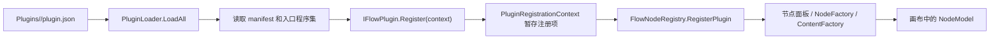
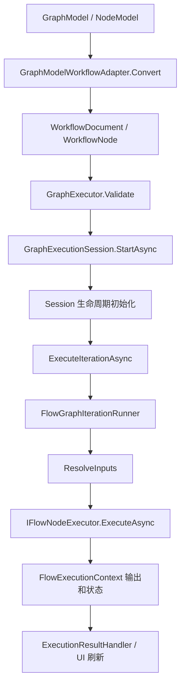
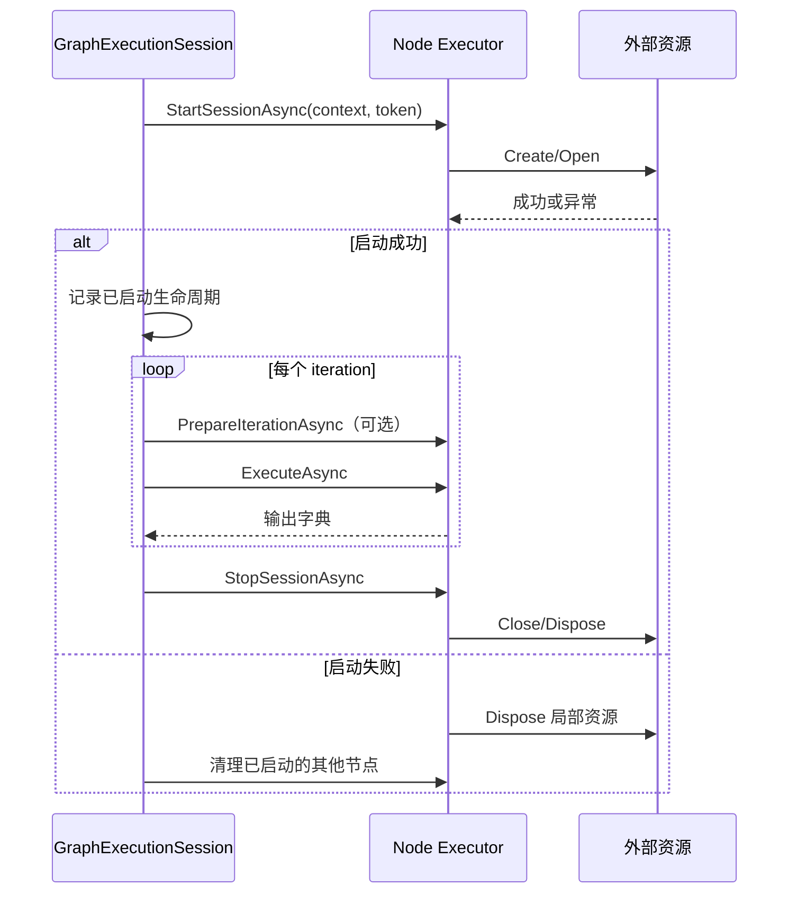

# NodeCraft 插件与节点开发指南

面向新人和 AI 编码助手的完整实践文档。本文以当前仓库的公共 API、示例插件和测试为准，目标是让你从零创建一个能被 NodeCraft 加载、显示、执行、保存和测试的插件节点。

## 0. 先决定你要开发哪一种节点

| 需求 | 推荐模式 | 主要接口 |
| --- | --- | --- |
| 输入几个值，计算后输出结果 | 无状态节点 | `IFlowNodeExecutor` |
| 节点有 Host、路径、阈值等配置 | 配置型节点 | `NodeModel` + `IWorkflowNodeValueProvider` |
| 需要打开连接、文件或设备，并在多次 iteration 中复用 | Session 节点 | `IFlowNodeSessionLifecycle` |
| 每次 iteration 都要等待下一帧/下一条消息 | 连续数据源 | `IFlowIterationSource` + Session 生命周期 |
| 输入数量由用户在画布上添加 | 动态输入节点 | `FlowDynamicInputTemplate` |
| 需要自定义设置面板或预览 | 自定义 UI 节点 | `ContentFactory` / `ExecutionResultHandler` |

建议先选择最小模式，再逐步增加能力。不要一开始就同时加入动态端口、后台线程、外部资源和自定义渲染；每增加一种能力，就增加一组对应的生命周期和测试约束。

## 1. 快速开始

### 1.1 阅读路径

| 你的目标 | 先读 |
| --- | --- |
| 5 分钟理解插件如何进入 NodeCraft | 第 2 节架构总览 |
| 创建第一个固定端口节点 | 第 4、5 节 |
| 保存节点配置 | 第 7 节 |
| 开发 TCP、相机、文件等资源型节点 | 第 9、12 节 |
| 开发可增删输入的节点 | 第 8 节 |
| 开发自定义设置面板或预览 | 第 10、11 节 |
| 节点不显示或执行失败 | 第 14 节 |
| 让 AI 按仓库约定开发 | 第 15 节 |

### 1.2 环境要求

- Windows：项目使用 WPF 和 `net8.0-windows`。
- .NET 8 SDK。
- 仓库本地 NuGet 源中的 `CommonControls.WPF` 包。
- 能够运行 PowerShell、`dotnet` 和 Git。

基础验证命令：

```powershell
dotnet build NodeCraft.sln
dotnet run --project NodeCraft.Tests/NodeCraft.Tests.csproj -f net8.0-windows
```

构建和测试的完整约定以 [CLAUDE.md](../CLAUDE.md) 为准。WPF 项目不能在缺少 WindowsDesktop SDK 的 Linux 环境中构建。

### 1.3 最短开发路径

1. 创建一个 `net8.0-windows` 插件项目。
2. 添加 `plugin.json`，让宿主能发现入口程序集。
3. 实现一个 `NodeModel` 和一个 `IFlowNodeExecutor`。
4. 用 `FlowNodeRegistration` 把定义、Executor 工厂和 NodeModel 工厂绑定起来。
5. 在 `IFlowPlugin.Register` 中调用 `context.Nodes.Register`。
6. 构建插件并放进 NodeCraft 的 `Plugins/<PackageFolder>/` 目录。
7. 启动宿主，确认节点出现在面板中并能连接到其他节点。
8. 添加模型投影、执行、XML 往返和最终插件包加载测试。

## 2. 架构总览

### 2.1 插件从文件到节点面板



宿主加载插件时，入口类型必须实现 `IFlowPlugin`。插件入口调用 `Register` 后，注册项先暂存在 `PluginRegistrationContext`，再由宿主原子地提交到 `FlowNodeRegistry`。注册过程中任何节点失败，都不应留下半个插件注册结果。

宿主会校验：

- manifest 的 `id` 和 `IFlowPlugin.Metadata.Id` 完全一致；
- plugin ID 非空且不能包含空白字符；
- `Metadata.Version` 不为空；
- 每个节点都有非空、稳定且不重复的 `TypeKey`；
- 显示在面板中的节点有 `NodeModelType` 和 `NodeFactory`；
- Executor 工厂存在且可以创建 Executor。

### 2.2 画布模型到执行器



这条链路解释了为什么节点开发不能只写 Executor：

- NodeModel 决定画布上有什么、配置是什么、如何保存；
- Definition 决定运行时有哪些端口、端口类型和数据阶段；
- WorkflowNode 是图适配后的运行时输入载体；
- Executor 只处理当前 Session/Iteration 的运行时逻辑；
- 注册项把这些部分连接起来；
- 测试必须覆盖至少一条真实数据路径，而不是只测试孤立的字符串函数。

### 2.3 核心对象速查

| 对象 | 所属阶段 | 责任 | 不应该负责什么 |
| --- | --- | --- | --- |
| `NodeModel` | 编辑器/持久化 | 保存节点身份、配置、端口描述和 UI 状态 | 打开 TCP 连接、读 WPF 控件、执行每次 iteration |
| `FlowNodeDefinition` | 注册/运行时契约 | 声明有效输入输出端口、类型、默认值和动态模板 | 保存用户配置 |
| `WorkflowNode` | 图执行输入 | 保存节点 ID、TypeKey、静态输入和动态端口 ID | 直接管理 UI |
| `FlowNodeRegistration` | 插件注册 | 绑定 Definition、Executor 工厂、NodeModel 工厂和 UI | 实现业务算法 |
| `IFlowNodeExecutor` | iteration 执行 | 读取运行时输入并返回输出 | 依赖编辑器实例 |
| `GraphExecutionSession` | Session | 初始化、串行执行 iteration、反向停止和清理 | 了解具体业务协议 |
| `FlowExecutionContext` | iteration 结果 | 保存节点状态、错误和输出端口值 | 保存跨 Session 的资源 |

## 3. 插件项目与包布局

### 3.1 推荐目录结构

```text
Company.Example.Plugin/
├── Company.Example.Plugin.csproj
├── plugin.json
├── Plugin/
│   └── ExamplePlugin.cs
├── Nodes/
│   ├── HelloValueNodeModel.cs
│   └── HelloValueExecutor.cs
├── Views/
│   ├── HelloValueEditor.xaml
│   └── HelloValueEditor.xaml.cs
└── lib/
    └── Company.Example.PrivateDependency.dll
```

如果节点没有自定义 UI，可以删除 `Views/`。如果没有私有依赖，可以删除 `lib/`。插件主程序集不能把宿主共享程序集复制进包。

宿主期望的最终目录是：

```text
<NodeCraft app root>/Plugins/company.example.plugin/
├── plugin.json
├── Company.Example.Plugin.dll
└── lib/
    └── Company.Example.PrivateDependency.dll
```

`Plugins` 的直接子目录中，只有包含 `plugin.json` 的目录会被作为插件包扫描；宿主按目录名排序后逐个加载。

### 3.2 plugin.json

最小 manifest：

```json
{
  "id": "company.example.plugin",
  "entryAssembly": "Company.Example.Plugin.dll",
  "entryType": "Company.Example.Plugin.ExamplePlugin",
  "apiVersion": "1.0"
}
```

带私有依赖时：

```json
{
  "id": "company.example.plugin",
  "entryAssembly": "Company.Example.Plugin.dll",
  "entryType": "Company.Example.Plugin.ExamplePlugin",
  "apiVersion": "1.0",
  "privateLibraryPath": "lib"
}
```

字段规则：

| 字段 | 要求 |
| --- | --- |
| `id` | 稳定、非空、不能含空白；必须等于 `PluginMetadata.Id` |
| `entryAssembly` | 插件包根目录内存在的 DLL 文件名 |
| `entryType` | 程序集内实现 `IFlowPlugin` 的完整类型名 |
| `apiVersion` | 当前宿主契约为主版本 `1.0` |
| `privateLibraryPath` | 相对插件根目录的私有 DLL 目录；默认约定为 `lib` |

不要用程序集版本、编译时间或随机值作为 `id` 或节点 `TypeKey`。图文件依赖这些稳定身份，改名会让旧图无法按原身份恢复。

### 3.3 .csproj 最小模板

```xml
<Project Sdk="Microsoft.NET.Sdk">
  <PropertyGroup>
    <TargetFramework>net8.0-windows</TargetFramework>
    <UseWPF>true</UseWPF>
    <Nullable>disable</Nullable>
    <LangVersion>9.0</LangVersion>
    <RootNamespace>Company.Example.Plugin</RootNamespace>
  </PropertyGroup>

  <ItemGroup>
    <ProjectReference Include="..\NodeCraft.Flow\NodeCraft.Flow.csproj"
                      Private="false" />
    <None Update="plugin.json">
      <CopyToOutputDirectory>PreserveNewest</CopyToOutputDirectory>
    </None>
  </ItemGroup>
</Project>
```

注意：

- `Private="false"` 防止把 `NodeCraft.Flow.dll` 当作插件私有 DLL 复制到输出目录；
- `UseWPF` 只有使用 WPF 编辑器或 WPF API 时才需要，但 NodeCraft 的插件项目通常按当前示例启用；
- 当前库项目使用 C# 9 和关闭 nullable，测试项目可以单独启用 nullable；
- 使用自定义 XAML 时还要从默认 `Page` 项中移除它，并作为 EmbeddedResource 包含，见第 9 节；
- 不要把 `CommonControls.WPF.dll`、`NodeCraft.Flow.dll` 或 WPF 框架 DLL 放到插件 `lib/`。

## 4. 第一个完整节点：Hello Value

下面的节点不是 Flow 输入端口，而是一个带字符串配置的值源节点。它展示了最重要的区别：配置保存在 `NodeModel`，通过 `WriteWorkflowInputs` 进入 `WorkflowNode.Inputs`，Executor 从运行时节点读取配置，并从 Definition 声明的输出端口发布结果。

### 4.1 NodeModel

文件：`Nodes/HelloValueNodeModel.cs`

```csharp
using System.Collections.Generic;
using NodeCraft.Flow;
using NodeCraft.Flow.Nodes;

namespace Company.Example.Plugin.Nodes
{
    public sealed class HelloValueNodeModel : NodeModel, IWorkflowNodeValueProvider
    {
        public const string FlowNodeTypeKey = "company.example.plugin.hello-value";

        public HelloValueNodeModel()
        {
            ExecutorType = FlowNodeTypeKey;
            Name = "Hello Value";
            InputParameters = new List<PortParameter>();
            OutputParameters = new List<PortParameter>
            {
                new PortParameter
                {
                    PortId = BuiltInNodePorts.Output,
                    Parameter = new Parameter
                    {
                        ParameterType = FlowDataType.String.Key,
                    },
                    PortDirection = EPortDirection.None,
                },
            };
        }

        public string ValueText { get; set; } = "Hello NodeCraft";

        public void WriteWorkflowInputs(WorkflowNode node)
        {
            node.Inputs[BuiltInNodePorts.Value] = ValueText ?? string.Empty;
        }
    }
}
```

关键点：

- `ExecutorType` 必须和注册 Definition 的 `TypeKey` 一致；
- `ValueText` 是用户配置，不是一个从其他节点连入的 Flow 端口；
- `WriteWorkflowInputs` 应把配置转换成稳定的 Workflow key；
- `OutputParameters` 只负责 NodeModel 的画布端口状态，运行时端口契约仍由 `FlowNodeDefinition.OutputPorts` 声明；
- `ValueText` 是可读写的公共简单属性，因此现有 XML 序列化器会把它作为自定义属性保存。

### 4.2 Executor

文件：`Nodes/HelloValueExecutor.cs`

```csharp
using System.Collections.Generic;
using System.Threading;
using System.Threading.Tasks;
using NodeCraft.Flow;
using NodeCraft.Flow.Nodes;

namespace Company.Example.Plugin.Nodes
{
    public sealed class HelloValueExecutor : IFlowNodeExecutor
    {
        public const string FlowNodeTypeKey
            = HelloValueNodeModel.FlowNodeTypeKey;

        public Task<IReadOnlyDictionary<string, object>> ExecuteAsync(
            FlowExecutionContext context,
            WorkflowNode node,
            FlowNodeDefinition definition,
            IReadOnlyDictionary<string, object> inputs,
            CancellationToken cancellationToken)
        {
            cancellationToken.ThrowIfCancellationRequested();

            node.Inputs.TryGetValue(BuiltInNodePorts.Value, out var rawValue);
            var value = rawValue as string
                ?? rawValue?.ToString()
                ?? string.Empty;

            IReadOnlyDictionary<string, object> outputs
                = new Dictionary<string, object>
                {
                    [BuiltInNodePorts.Output] = value,
                };

            return Task.FromResult(outputs);
        }
    }
}
```

这里从 `node.Inputs` 读取 `ValueText`，不是从 `inputs` 读取，因为 `value` 没有被声明为一个运行时 Flow 输入端口。`inputs` 主要由 `FlowGraphIterationRunner` 按 Definition 的输入端口解析得到。配置型节点可以通过 `node.Inputs` 读取静态 Workflow 配置，但必须使用稳定 key 并在 Session 启动时验证配置。

如果节点确实有一个从其他节点连入的输入端口，应该在 Definition 中声明它，然后从 `inputs` 按端口 ID 读取：

```csharp
var input = inputs.TryGetValue(BuiltInNodePorts.Input, out var value)
    ? value
    : null;
```

### 4.3 插件入口和注册

文件：`Plugin/ExamplePlugin.cs`

```csharp
using System;
using NodeCraft.Flow;
using Company.Example.Plugin.Nodes;

namespace Company.Example.Plugin
{
    public sealed class ExamplePlugin : IFlowPlugin
    {
        public PluginMetadata Metadata { get; } = new PluginMetadata
        {
            Id = "company.example.plugin",
            DisplayName = "Example Nodes",
            Version = new Version(1, 0, 0),
        };

        public void Register(IPluginContext context)
        {
            if (context == null)
            {
                throw new ArgumentNullException(nameof(context));
            }

            context.Nodes.Register(
                new FlowNodeRegistration(
                    new FlowNodeDefinition
                    {
                        TypeKey = HelloValueNodeModel.FlowNodeTypeKey,
                        DisplayName = "Hello Value",
                        Category = "Value",
                        OutputPorts =
                        {
                            new FlowPortDefinition
                            {
                                Id = BuiltInNodePorts.Output,
                                DisplayName = "Value",
                                IOType = EIOType.Output,
                                DataType = FlowDataType.String,
                                PreferredDirection = EPortDirection.Right,
                            },
                        },
                    },
                    () => new HelloValueExecutor())
                {
                    NodeModelType = typeof(HelloValueNodeModel),
                    NodeFactory = () => new HelloValueNodeModel(),
                    PaletteDisplayName = "Hello Value",
                    PaletteDescription = "Emits a configured string value.",
                });
        }
    }
}
```

注册项中几个工厂的职责：

| 属性 | 用途 |
| --- | --- |
| `ExecutorFactory` | 每个图 Session 创建一个新的 Executor 实例 |
| `NodeModelType` | 将画布模型类型映射到稳定 TypeKey，支持图加载和面板元数据 |
| `NodeFactory` | 从节点面板拖入节点时创建新的 NodeModel |
| `ContentFactory` | 可选的自定义 WPF 内容；不提供时使用默认节点内容 |
| `ExecutionResultHandler` | 可选地把执行结果写回 NodeModel 的预览状态 |
| `ShowInPalette` | 是否显示在节点面板；显示时必须有 NodeModel 类型和工厂 |
| `RefreshContentAfterExecution` | 执行完成后是否让画布刷新节点内容 |

### 4.4 面板和执行验证

最小验证顺序：

1. 构建插件项目，确认 DLL 和 `plugin.json` 输出到同一个目录。
2. 将它们复制到 NodeCraft 的 `Plugins/company.example.plugin/`。
3. 启动宿主，打开节点面板，确认 `Value` 类别出现 `Hello Value`。
4. 拖入节点，确认默认值为 `Hello NodeCraft`。
5. 连接一个接受 `string` 或 `object` 的预览节点。
6. 执行一次，确认输出为 `Hello NodeCraft`。
7. 修改值后保存图文件，关闭并重新加载，确认值仍存在。

最小测试应至少覆盖：

- manifest 可读且入口类型存在；
- 插件 Metadata 与 manifest ID 一致；
- 注册结果的 TypeKey、类别、输出端口和 NodeFactory 正确；
- `WriteWorkflowInputs` 写入预期 key；
- Executor 输出 key 与 Definition 输出端口一致；
- XML 往返后 `ValueText` 保持不变。

## 5. 插件注册规则和版本身份

### 5.1 三种身份必须分清

| 身份 | 示例 | 用途 |
| --- | --- | --- |
| 插件 ID | `company.example.plugin` | manifest、插件元数据和日志 |
| 节点 TypeKey | `company.example.plugin.hello-value` | Definition、NodeModel、图节点身份 |
| NodeModel CLR 类型 | `Company.Example.Plugin.Nodes.HelloValueNodeModel` | C# 类型实例化和注册映射 |

插件 ID 和节点 TypeKey 都是持久身份。CLR 类型名可以在注册映射和兼容逻辑中使用，但 `.flow.xml` 的稳定节点身份优先依赖 ExecutorType/TypeKey。重命名 TypeKey 相当于新建节点类型；如果必须迁移，应提供明确的迁移策略，而不是直接覆盖旧值。

### 5.2 注册失败的典型原因

- manifest `id` 与 `Metadata.Id` 不相等；
- `entryType` 拼写错误，或入口类型没有实现 `IFlowPlugin`；
- `Metadata.Version` 为空；
- 两个注册项使用相同 TypeKey；
- 已加载插件中已经存在相同 TypeKey；
- 面板节点没有 `NodeModelType` 或 `NodeFactory`；
- Executor factory 返回 null；
- 插件把宿主共享 DLL 复制进了包，造成类型身份冲突；
- 私有 DLL 不在 manifest 指定的 `lib` 目录中。

## 6. 端口、类型和 slot

### 6.1 固定端口定义

运行时端口通过 `FlowNodeDefinition.InputPorts` 和 `OutputPorts` 声明。一个有字符串输入和字符串输出的节点可以这样定义：

```csharp
new FlowNodeDefinition
{
    TypeKey = "company.example.plugin.transform",
    DisplayName = "Transform Text",
    Category = "Text",
    InputPorts =
    {
        new FlowPortDefinition
        {
            Id = BuiltInNodePorts.Input,
            DisplayName = "Input",
            IOType = EIOType.Input,
            DataType = FlowDataType.String,
            PreferredDirection = EPortDirection.Left,
            IsRequired = true,
            Availability = FlowPortAvailability.Iteration,
        },
    },
    OutputPorts =
    {
        new FlowPortDefinition
        {
            Id = BuiltInNodePorts.Output,
            DisplayName = "Output",
            IOType = EIOType.Output,
            DataType = FlowDataType.String,
            PreferredDirection = EPortDirection.Right,
            Availability = FlowPortAvailability.Iteration,
        },
    },
}
```

`FlowPortDefinition` 字段：

| 字段 | 含义 | 开发建议 |
| --- | --- | --- |
| `Id` | Workflow 输入/输出和 Executor 字典使用的稳定 key | 用常量，避免业务代码散落字符串 |
| `DisplayName` | 画布上显示的端口名 | 面向用户，不参与数据查找 |
| `IOType` | `EIOType.Input` 或 `EIOType.Output` | 与端口所在列表保持一致 |
| `DataType` | Flow 类型契约 | 优先使用 `FlowDataType` 静态实例 |
| `PreferredDirection` | 端口在节点上的首选方向 | 输入通常 `Left`，输出通常 `Right` |
| `IsRequired` | 输入值缺失时是否阻止执行 | 配置型输入通常另行在 Session 启动校验 |
| `AllowMultipleConnections` | 是否允许多个连线 | 只有明确支持集合语义时才打开 |
| `DefaultValue` | 没有配置时的默认值 | 不要把默认值误当成动态链接缺失时的回退 |
| `Availability` | `Session` 或 `Iteration` | 决定值在哪个阶段可用 |
| `IsControlPort` | 由 `DataType == FlowDataType.Control` 推导 | 不要手动设置，它是计算属性 |

### 6.2 Flow 类型

当前内置类型包括：

| 类型 | CLR 语义 | 适用场景 |
| --- | --- | --- |
| `FlowDataType.String` | `string` | 文本、路径、标签 |
| `FlowDataType.Number` | 数字类型集合，通常按数值处理 | 数值计算、阈值 |
| `FlowDataType.Boolean` | `bool` | 开关、条件 |
| `FlowDataType.Object` | `object` | 兼容任意对象；保留旧的通配语义 |
| `FlowDataType.Any` | `*` | 明确表示任意类型 |
| `FlowDataType.MatchType` | `MATCH_TYPE` | 需要按相邻类型匹配的节点 |
| `FlowDataType.Control` | `FlowControlSignal` | `flowIn`、条件分支 |
| `FlowDataType.Image` | `FlowImage` | 图像数据 |
| `FlowDataType.CameraCalibration` | `CameraCalibration` | 相机标定数据 |

`FlowDataType.Object` 是当前项目的兼容性通配类型：例如 Text Preview 可以用 `object` 接收多种值。新节点如果需要严格校验，应选择具体类型；如果确实能处理任意对象，才使用 `object` 或 `*`。

类型校验由 `FlowTypeValidator` 和 `FlowDataType.IsCompatibleWith` 共同完成：

- 同类型连接通过；
- `object` 保留兼容旧节点的宽松语义；
- `control` 只能与 `control` 连接；
- `MATCH_TYPE` 由运行时匹配相关类型；
- 严格/非严格模式对联合类型的处理不同，节点注册不应自行复制一套兼容算法。

### 6.3 Session 和 Iteration 端口

`FlowPortAvailability` 只有两个阶段：

- `Session`：Session 启动时初始化一次，在后续 iteration 中复用；
- `Iteration`：每次图执行 iteration 都重新解析或生成。

例如相机节点可以在 Session 阶段建立设备连接，在每个 iteration 阶段准备下一帧；普通值节点和计算节点通常只使用 Iteration 输入输出。

输入值的生命周期必须和 Definition 一致：

```text
Session input  ── StartSessionAsync / InitializeSessionAsync ──> session value store
Iteration input ── ResolveInputs(current FlowExecutionContext) ──> ExecuteAsync
```

把一个只在 Session 初始化时存在的资源错误地声明为 Iteration 输出，会被运行时阶段校验拒绝；把每帧数据错误地保存为 Session 状态，则会造成数据复用和连续执行错误。

### 6.4 `flowIn` 控制端口

`FlowNodeRegistry` 注册 Definition 时会通过 `EnsureControlInputPort` 确保输入端口列表第 0 个是：

```csharp
new FlowPortDefinition
{
    Id = FlowPorts.FlowIn,
    DisplayName = "Flow In",
    IOType = EIOType.Input,
    DataType = FlowDataType.Control,
    PreferredDirection = EPortDirection.Top,
    IsRequired = false,
    AllowMultipleConnections = false,
}
```

因此标准节点的有效 Definition 中，`flowIn` 通常是输入 slot 0。它用于控制节点是否在当前 iteration 执行：没有控制连线时节点正常运行；有控制连线但当前值不是 `FlowControlSignal.Active` 时，下游节点会被标记为 `Skipped`。

插件不应在注册后手动删除或移动 `flowIn`。如果节点模型需要同步端口，应通过现有的 Definition、Socket Resolver 和动态端口解析路径处理，而不是假设 `InputParameters[0]` 永远是业务输入。

### 6.5 slot 规则：定义索引，不是模型列表索引

这是 NodeCraft 节点开发最容易出现的错误之一。

错误写法：

```csharp
// 错误：InputParameters 的顺序可能包含动态端口、旧图端口或不同的画布布局。
var port = node.InputParameters[slot];
```

正确思路：

```csharp
var port = definition.InputPorts[slot];
if (port == null)
{
    throw new InvalidOperationException($"Input slot {slot} is not defined.");
}

var portId = port.Id;
if (!inputs.TryGetValue(portId, out var value))
{
    throw new InvalidOperationException(
        $"Required input '{portId}' was not provided.");
}
```

规则总结：

- `slot` 是有效 `FlowNodeDefinition` 端口列表的索引；
- `PortId` 是字典和 Workflow 使用的稳定 key；
- `NodeModel.InputParameters` 是画布运行时模型，不等价于 Definition 的 slot 表；
- `flowIn` 会占用 Definition 输入 slot 0；
- 动态端口必须在有效 Definition 中解析后再使用；
- `Connector.Slot` 和 `Connector.IsInput` 携带连线的 slot 语义。

## 7. NodeModel、WorkflowNode 与持久化

### 7.1 三层数据流

```text
NodeModel 属性 / 端口状态
        │
        │ IWorkflowNodeValueProvider.WriteWorkflowInputs
        ▼
WorkflowNode.Inputs + DynamicInputPortIds
        │
        │ GraphExecutor / GraphExecutionSession
        ▼
IFlowNodeExecutor.ExecuteAsync(context, node, definition, inputs, cancellationToken)
```

三层不要混用：

1. `NodeModel` 面向画布编辑器和图文件保存；
2. `WorkflowNode` 是一个与 UI 无关的运行时表示；
3. `inputs` 是按有效 Definition 解析后的当前 iteration 输入。

### 7.2 哪些值放在哪里

| 值 | NodeModel 属性 | Workflow key | Definition 端口 | Executor 读取位置 |
| --- | --- | --- | --- | --- |
| Host、Port、路径、阈值 | 是 | 是 | 通常不是 | `node.Inputs`，Session 启动时读取 |
| 由其他节点传入的文本 | 可保存端口状态 | 通过 LinkRef 解析 | 是 | `inputs[portId]` |
| 动态 Message 端口值 | 端口/链接状态 | 是 | 动态端口是 | `inputs[message_N]` |
| 当前相机帧 | 通常不持久化 | 运行时产生 | Session/Iteration 输出 | Session 状态或 `inputs` |
| 预览文本 | 可放临时属性 | 不作为业务输入 | 通常不是 | `ExecutionResultHandler` 写回 |

配置型节点的最小投影：

```csharp
public string Host { get; set; } = string.Empty;

public int Port { get; set; }

public bool StopOnFailure { get; set; } = true;

public void WriteWorkflowInputs(WorkflowNode node)
{
    node.Inputs["host"] = Host ?? string.Empty;
    node.Inputs["port"] = Port;
    node.Inputs["stopOnFailure"] = StopOnFailure;
}
```

Executor 在 Session 初始化时从同一组稳定 key 读取：

```csharp
var host = ReadRequiredString(context.Node.Inputs, "host");
var port = ReadInteger(context.Node.Inputs, "port");
var stopOnFailure = ReadBoolean(
    context.Node.Inputs,
    "stopOnFailure",
    defaultValue: true);
```

不要让编辑器保存的属性名、Workflow key 和 Executor 读取的 key 各自随意命名。推荐在模型或节点内部集中定义常量，至少通过测试确保三条路径一致。

### 7.3 GraphModelWorkflowAdapter 的行为

宿主的 `FlowPage` 会把画布模型转换为 Workflow：

1. `GraphModelWorkflowAdapter.Convert(graph)` 先协调 GraphModel 的 Links 和端口 LinkId；
2. 每个 NodeModel 被转换成一个 `WorkflowNode`；
3. 如果节点实现 `IWorkflowNodeValueProvider`，调用 `WriteWorkflowInputs`；
4. 端口 LinkId 被转换成 `LinkRef`，写入对应 `WorkflowNode.Inputs`；
5. 动态端口 ID 写入 `WorkflowNode.DynamicInputPortIds`；
6. `GraphExecutor` 根据 TypeKey 解析注册项和有效 Definition。

因此，节点只把配置写入 Workflow，不要在 `WriteWorkflowInputs` 中直接读取其他节点的输出。链接值由图适配器和运行时按阶段解析。

### 7.4 XML 持久化

现有 `GraphModelXmlSerializer` 自动处理：

- NodeModel 基础字段：ID、名称、位置、尺寸、ExecutorType；
- 输入输出端口列表和 LinkId；
- 支持的公共可读写自定义属性：字符串、布尔、整数、长整数、浮点、十进制和枚举；
- 动态端口标记；
- Graph Links。

节点新增配置属性时，优先使用简单公共属性：

```csharp
public int ConnectTimeoutMilliseconds { get; set; } = 5000;

public bool StopOnSendFailure { get; set; } = true;
```

不要直接把 `TcpClient`、`Task`、WPF 控件、线程、文件流或大型运行时缓存放到 NodeModel 公共属性中；它们不是图配置，且不能被安全地序列化。

推荐的 XML 往返测试：

```csharp
var original = new HelloValueNodeModel
{
    Id = "hello",
    ValueText = "persisted",
};

GraphModelXmlSerializer.Save(
    new GraphModel
    {
        Nodes = new List<NodeModel> { original },
        Links = new List<GraphLink>(),
    },
    path);

var loaded = (HelloValueNodeModel)
    GraphModelXmlSerializer.Load(path).Nodes.Single();

return loaded.ValueText == "persisted";
```

测试应同时确认：

- 默认值在新节点上正确；
- 修改值后 XML 中有属性；
- 加载后属性恢复；
- `WriteWorkflowInputs` 在加载的 NodeModel 上仍写入相同 key；
- 动态端口 ID 和链接没有因为配置属性变化而丢失。

## 8. 动态输入端口

### 8.1 什么时候使用动态端口

使用动态端口的条件是：用户需要在画布上增加或删除同一语义的输入，并且每个输入都应该拥有独立连线和稳定顺序。例如 TCP Client 的 `message_1`、`message_2`、`message_3`。

如果只是一个可选值，不要创建动态端口；使用固定端口加 `IsRequired = false` 或 `DefaultValue`。如果输入数量固定，也不要使用动态模板。

### 8.2 动态模板

注册时给 Definition 添加 `FlowDynamicInputTemplate`：

```csharp
DynamicInputTemplate = new FlowDynamicInputTemplate
{
    PortIdPrefix = "message",
    DisplayNamePrefix = "Message",
    DataType = FlowDataType.Object,
    PreferredDirection = EPortDirection.Left,
    IsRequired = true,
    Availability = FlowPortAvailability.Iteration,
    MinCount = 1,
    InitialCount = 1,
    MaxCount = null,
},
```

字段规则：

| 字段 | 作用 |
| --- | --- |
| `PortIdPrefix` | 生成 `message_1`、`message_2` 等稳定 ID |
| `DisplayNamePrefix` | 生成画布显示名 `Message 1` 等 |
| `DataType` | 每个动态端口的类型 |
| `PreferredDirection` | 动态输入在画布上的方向 |
| `IsRequired` | 动态端口缺值是否阻止当前节点执行 |
| `Availability` | 动态值属于 Session 还是 Iteration |
| `MinCount` | 允许保留的最小数量 |
| `InitialCount` | 新节点首次 materialize 时的数量 |
| `MaxCount` | 最大数量；`null` 表示不限制 |

`FlowDynamicInputResolver.ValidateTemplate` 会检查：

- prefix 非空；
- DataType 不为空；
- Min/Initial/Max 的范围关系正确；
- prefix 不和固定输入端口冲突；
- `InitialCount >= MinCount`；
- `InitialCount <= MaxCount`（有上限时）。

### 8.3 Materialize 和有效 Definition

动态节点有两种端口状态：

- NodeModel 上保存的运行时端口列表：供画布保存、显示和链接；
- 当前图执行使用的有效 Definition：把注册模板和节点的动态 ID 合并后，生成最终端口顺序。

下面是宿主/测试侧看到的常用流程，不是插件业务代码必须直接调用的公共 API。当前 `FlowDynamicInputResolver` 在 `NodeCraft.Flow` 中是 `internal`；插件只需要在注册 Definition 时提供模板，通用画布和宿主运行时负责 materialize/resolve。

宿主/测试侧的常用流程：

```csharp
FlowDynamicInputResolver.MaterializeNodePorts(node, registration.Definition);

var dynamicPortIds = FlowDynamicInputResolver.GetDynamicPortIds(node);
var effectiveDefinition = FlowDynamicInputResolver.ResolveDefinition(
    registration.Definition,
    dynamicPortIds);
```

不要在 Executor 构造函数中添加动态端口；节点创建/加载和通用画布负责 materialize，Executor 只消费有效 Definition。

### 8.4 动态端口的执行顺序

错误写法：

```csharp
// 错误：Dictionary 的枚举不是动态端口语义，也无法保证 Definition 顺序。
foreach (var input in inputs)
{
    await SendAsync(input.Value);
}
```

正确写法：

```csharp
foreach (var inputPort in definition.InputPorts
    .Where(port => port != null && port.IsDynamic))
{
    cancellationToken.ThrowIfCancellationRequested();

    if (!inputs.TryGetValue(inputPort.Id, out var value))
    {
        throw new InvalidOperationException(
            $"Required input '{inputPort.Id}' was not provided.");
    }

    await SendOneAsync(value, cancellationToken)
        .ConfigureAwait(false);
}
```

顺序由 `definition.InputPorts` 决定，而不是由 `inputs` 字典决定。删除中间端口时，通用 Flow 逻辑会协调后续端口和链接；插件 Executor 不应该自行重命名或重排动态端口。

### 8.5 动态端口测试矩阵

至少添加以下测试：

| 场景 | 需要验证 |
| --- | --- |
| 新节点 materialize | 创建 `message_1`，数量满足 InitialCount |
| 添加端口 | ID 递增，旧端口顺序和链接不变 |
| 删除中间端口 | 后续链接按画布规则重建，定义顺序正确 |
| 无限数量 | `MaxCount = null` 时继续添加 |
| 缺少必需值 | 节点被跳过或 Executor 给出端口 ID 明确的错误 |
| 端口类型不兼容 | Graph validation 拒绝链接 |
| 输入字典顺序变化 | Executor 仍按 Definition 顺序发送/计算 |
| XML 往返 | 动态 ID、`IsDynamic` 标记和 LinkId 保持 |

动态端口的实现参考：[CommunicationPlugin.cs](../NodeCraft.Communication/Plugin/CommunicationPlugin.cs)、[TcpClientSendExecutor.cs](../NodeCraft.Communication/Nodes/TcpClientSendExecutor.cs) 和 [DynamicInputPortTests.cs](../NodeCraft.Tests/DynamicInputPortTests.cs)。

## 9. Executor 开发模式和 Session 生命周期

### 9.1 无状态 iteration Executor

无状态节点只依赖当前 iteration 的 `inputs`，不保存跨调用资源：

```csharp
public sealed class AddTextExecutor : IFlowNodeExecutor
{
    public Task<IReadOnlyDictionary<string, object>> ExecuteAsync(
        FlowExecutionContext context,
        WorkflowNode node,
        FlowNodeDefinition definition,
        IReadOnlyDictionary<string, object> inputs,
        CancellationToken cancellationToken)
    {
        cancellationToken.ThrowIfCancellationRequested();

        var left = inputs.TryGetValue("left", out var leftValue)
            ? leftValue?.ToString() ?? string.Empty
            : string.Empty;
        var right = inputs.TryGetValue("right", out var rightValue)
            ? rightValue?.ToString() ?? string.Empty
            : string.Empty;

        IReadOnlyDictionary<string, object> outputs
            = new Dictionary<string, object>
            {
                ["output"] = left + right,
            };

        return Task.FromResult(outputs);
    }
}
```

适用场景：文本变换、数值运算、布尔逻辑、简单条件和预览转发。

约束：

- 每次执行开始检查取消令牌；
- 只读取 Definition 声明的运行时输入；
- 输出 key 必须存在于 Definition.OutputPorts；
- 不把 `Task`、连接、线程或 WPF 控件存到 Executor 字段；
- 如果逻辑会阻塞或需要释放资源，不要伪装成无状态节点。

### 9.2 带配置的 Executor

配置型节点不只是“静态配置 + Flow 输入”两类。当前运行时至少要区分：NodeModel 投影出的静态值、画布连接保存的 `LinkRef`、Definition 提供的默认值、Session 阶段的连接值，以及当前 iteration 的连接值。`node.Inputs` 和传给 `ExecuteAsync` 的 `inputs` 也不是同一个字典。

完整数据路径如下：

```text
NodeModel 属性
    │ IWorkflowNodeValueProvider.WriteWorkflowInputs
    ▼
GraphModelWorkflowAdapter
    │ 加入画布 LinkId 对应的 LinkRef
    ▼
WorkflowNode.Inputs
    ├─ 静态配置值：Host、Port、Prefix、开关等
    └─ LinkRef：只描述“从哪个节点哪个 slot 取值”
          │
          ├─ Session 阶段：GraphExecutionSession.ResolveSessionInputs
          │       └─ IFlowNodeSessionInitializer.InitializeSessionAsync(inputs)
          │
          └─ Iteration 阶段：FlowGraphIterationRunner.ResolveInputs
                  └─ IFlowNodeExecutor.ExecuteAsync(..., inputs, ...)
```

| 来源 | 保存/产生位置 | 进入 Executor 的方式 | 典型用途 |
| --- | --- | --- | --- |
| NodeModel 配置 | `WriteWorkflowInputs` 写入 `WorkflowNode.Inputs` | 直接读 `node.Inputs`；如果它同时是 Definition 输入，也会进入 `inputs` | Host、Port、Prefix、开关 |
| 未连接但有配置的输入端口 | `WorkflowNode.Inputs[portId]` | 运行时把原值放进当前阶段的 `inputs` | 用户直接填写的输入 |
| Definition 默认值 | `FlowPortDefinition.DefaultValue` | NodeModel/Workflow 没有该 key 时，由解析器放进 `inputs` | 可选阈值、默认模式 |
| Iteration `LinkRef` | `WorkflowNode.Inputs[portId]` | 从本轮 `FlowExecutionContext` 的源输出读取 | 当前帧、当前消息、上游计算结果 |
| Session `LinkRef` | `WorkflowNode.Inputs[portId]` | 从 `SessionValueStore` 读取，供 Session 初始化和后续 iteration 使用 | 设备句柄、相机能力、初始化后的目录 |
| 缺失的必需输入 | 运行时校验 | GraphExecutor 可能在启动前报错；iteration 阶段也可能跳过节点 | 连接断开、必填配置缺失 |
| 控制输入 | Definition 的 `IsControlPort` | 由 iteration runner 判断是否有 active control；未激活时跳过节点 | `flowIn`、条件分支 |

其中最容易混淆的是：`node.Inputs` 是图适配后的“配置和链接描述”，`inputs` 是运行到当前阶段后已经解析出的“本次可消费值”。`LinkRef` 本身不是业务数据，Executor 不应该把它当作字符串或对象直接处理。

`FlowGraphIterationRunner.ResolveInputs` 会按有效 Definition 的输入端口逐个处理：

1. 没有 Workflow key 时，如果端口有 `DefaultValue`，写入默认值；否则暂时不加入；
2. 值是 `LinkRef` 时，Iteration 输出从当前 `FlowExecutionContext` 取，Session 输出从 `SessionValueStore` 取；
3. 值不是 `LinkRef` 时，把 Workflow 中的配置值放入 `inputs`；
4. 必需运行时输入缺失时，节点会被跳过；控制端口还会单独判断 active 信号；
5. 已配置的 `LinkRef` 如果源值缺失，不会再回退到目标端口的 `DefaultValue`。

Session 阶段还有一个 API 边界：`IFlowNodeSessionLifecycle.StartSessionAsync` 只接收 `FlowNodeSessionContext` 和取消令牌，不接收已经解析好的 `inputs`；它适合打开资源和读取 `context.Node.Inputs` 中的静态配置。需要消费已解析 Session 输入时，实现 `IFlowNodeSessionInitializer.InitializeSessionAsync(context, inputs, cancellationToken)`。这两个接口不能混为一个“初始化函数”。

### 9.2.1 无 Session：在每次 `ExecuteAsync` 读取静态配置

适用于字符串转换、数值计算等无资源节点。NodeModel 通过 `WriteWorkflowInputs` 把配置写入 `WorkflowNode.Inputs`；Executor 每次执行时从 `node.Inputs` 读取静态配置，从 `inputs` 读取本轮已经解析好的 Flow 输入：

```csharp
public sealed class PrefixNodeModel : NodeModel, IWorkflowNodeValueProvider
{
    public string Prefix { get; set; } = "[value] ";

    public void WriteWorkflowInputs(WorkflowNode node)
    {
        node.Inputs["prefix"] = Prefix ?? string.Empty;
    }
}

public sealed class PrefixExecutor : IFlowNodeExecutor
{
    public Task<IReadOnlyDictionary<string, object>> ExecuteAsync(
        FlowExecutionContext context,
        WorkflowNode node,
        FlowNodeDefinition definition,
        IReadOnlyDictionary<string, object> inputs,
        CancellationToken cancellationToken)
    {
        cancellationToken.ThrowIfCancellationRequested();

        if (!node.Inputs.TryGetValue("prefix", out var rawPrefix))
        {
            throw new InvalidOperationException(
                $"Node '{node.Id}' is missing configuration 'prefix'.");
        }

        if (!inputs.TryGetValue("input", out var rawInput))
        {
            throw new InvalidOperationException(
                $"Node '{node.Id}' is missing resolved input 'input'.");
        }

        var value = (rawPrefix?.ToString() ?? string.Empty)
            + (rawInput?.ToString() ?? string.Empty);

        return Task.FromResult<IReadOnlyDictionary<string, object>>(
            new Dictionary<string, object>
            {
                ["output"] = value,
            });
    }
}
```

这里 `prefix` 是持久化配置，`input` 是上游 Flow 输入。无 Session 节点没有需要跨 iteration 保存的连接或设备状态，因此每次执行重新读取 `node.Inputs` 是清晰且安全的做法。若配置同时被声明为 Definition 输入端口，解析器也可能把它放入 `inputs`；代码必须按节点契约明确读取位置，不能靠“两个字典碰巧都有值”工作。

### 9.2.2 有 Session：在 `StartSessionAsync` 读取一次并缓存资源

适用于 TCP、相机、文件或设备节点。静态 Host、Port、路径和策略配置在 Session 启动时读取、校验并用于打开资源；后续 `ExecuteAsync` 不应每轮重新连接，而是复用字段中的资源。当前 TCP Client Send 就是这种模式：

下面保留 TCP 示例中与“配置读取时机”有关的关键代码；`ReadSettings` 负责对 Host、Port、超时和布尔策略做类型/范围校验，完整实现见 `NodeCraft.Communication/Nodes/TcpClientSendExecutor.cs`。

```csharp
using System;
using System.Collections.Generic;
using System.Linq;
using System.Threading;
using System.Threading.Tasks;
using NodeCraft.Communication.Transport;
using NodeCraft.Flow;

internal sealed class TcpLikeExecutor :
    IFlowNodeExecutor, IFlowNodeSessionLifecycle
{
    private readonly ITcpClientConnectionFactory _connectionFactory;
    private ITcpClientConnection _connection;
    private bool _stopOnSendFailure = true;

    public TcpLikeExecutor(
        ITcpClientConnectionFactory connectionFactory)
    {
        _connectionFactory = connectionFactory
            ?? throw new ArgumentNullException(nameof(connectionFactory));
    }

    public async Task StartSessionAsync(
        FlowNodeSessionContext context,
        CancellationToken cancellationToken)
    {
        // 这里读取的是 NodeModel 投影出的静态配置。
        var settings = ReadSettings(context.Node.Inputs);
        var connection = _connectionFactory.Create();

        try
        {
            await connection.ConnectAsync(
                    settings.Host,
                    settings.Port,
                    TimeSpan.FromMilliseconds(
                        settings.ConnectTimeoutMilliseconds),
                    cancellationToken)
                .ConfigureAwait(false);

            _stopOnSendFailure = settings.StopOnSendFailure;
            _connection = connection;
        }
        catch
        {
            connection.Dispose();
            throw;
        }
    }

    public async Task<IReadOnlyDictionary<string, object>> ExecuteAsync(
        FlowExecutionContext context,
        WorkflowNode node,
        FlowNodeDefinition definition,
        IReadOnlyDictionary<string, object> inputs,
        CancellationToken cancellationToken)
    {
        var connection = _connection
            ?? throw new InvalidOperationException(
                "TCP client session has not started.");

        foreach (var inputPort in definition.InputPorts
            .Where(port => port != null && port.IsDynamic))
        {
            cancellationToken.ThrowIfCancellationRequested();
            if (!inputs.TryGetValue(inputPort.Id, out var value))
            {
                throw new InvalidOperationException(
                    $"Required input '{inputPort.Id}' was not resolved.");
            }

            var payload = TcpPayloadEncoder.Encode(value, inputPort.Id);
            try
            {
                await connection.SendAsync(payload, cancellationToken)
                    .ConfigureAwait(false);
            }
            catch (OperationCanceledException)
            {
                throw;
            }
            catch
            {
                if (_stopOnSendFailure)
                {
                    throw;
                }
            }
        }

        return new Dictionary<string, object>();
    }

    public Task StopSessionAsync(
        FlowNodeSessionContext context,
        CancellationToken cancellationToken)
    {
        var connection = _connection;
        _connection = null;
        _stopOnSendFailure = true;
        connection?.Dispose();
        return Task.CompletedTask;
    }
}
```

这两种读取方式不能互换：

| 节点模式 | 静态配置读取 | `ExecuteAsync` 读取 |
| --- | --- | --- |
| 无 Session | 每次从 `node.Inputs` 读取并校验 | `node.Inputs` 的配置 + `inputs` 的当前 Flow 值 |
| 有 Session | `StartSessionAsync` 从 `context.Node.Inputs` 读取一次并初始化资源 | 缓存的资源 + `inputs` 的当前 Flow 值 |

如果 Host、Port 等配置本身被声明成 `FlowPortAvailability.Session` 的 Definition 输入，并且可能来自上游 Session 输出，则不要在 `StartSessionAsync` 中期待已经解析好的 `inputs`；这个接口没有 `inputs` 参数。此时应由 `IFlowNodeSessionInitializer.InitializeSessionAsync(context, inputs, cancellationToken)` 消费解析后的 Session 输入，并在其中完成依赖这些输入的初始化；`StartSessionAsync`/`StopSessionAsync` 负责生命周期边界和最终清理。

```csharp
public async Task<IReadOnlyDictionary<string, object>> InitializeSessionAsync(
    FlowNodeSessionContext context,
    IReadOnlyDictionary<string, object> inputs,
    CancellationToken cancellationToken)
{
    cancellationToken.ThrowIfCancellationRequested();

    var host = ReadRequiredString(inputs, "host");
    var port = ReadRequiredPort(inputs, "port");
    _connection = _connectionFactory.Create();
    await _connection.ConnectAsync(
            host,
            port,
            cancellationToken)
        .ConfigureAwait(false);

    return new Dictionary<string, object>();
}
```

上面的 initializer 示例需要配合失败清理：连接成功前抛错要释放局部对象，`StopSessionAsync` 要处理已保存的 `_connection`。`IFlowNodeSessionInitializer` 不是把所有配置都自动传给 Executor 的快捷方式，它只接收有效 Definition 中属于 Session 阶段、已经按默认值和链接规则解析后的输入。

```csharp
public sealed class ConfiguredExecutor : IFlowNodeExecutor
{
    private readonly ILogger _logger;

    public ConfiguredExecutor(ILogger logger)
    {
        _logger = logger ?? NullLogger.Instance;
    }

    public Task<IReadOnlyDictionary<string, object>> ExecuteAsync(
        FlowExecutionContext context,
        WorkflowNode node,
        FlowNodeDefinition definition,
        IReadOnlyDictionary<string, object> inputs,
        CancellationToken cancellationToken)
    {
        cancellationToken.ThrowIfCancellationRequested();

        // prefix 是 NodeModel 写入的静态配置，不是上游 Flow 输出。
        if (!node.Inputs.TryGetValue("prefix", out var rawPrefix))
        {
            throw new InvalidOperationException(
                $"Node '{node.Id}' is missing configuration 'prefix'.");
        }

        var prefix = rawPrefix?.ToString() ?? string.Empty;
        if (!inputs.TryGetValue("input", out var rawInput))
        {
            throw new InvalidOperationException(
                $"Node '{node.Id}' is missing resolved Flow input 'input'.");
        }

        var input = rawInput?.ToString() ?? string.Empty;

        _logger.LogDebug(
            "Executing configured node '{NodeId}' with input '{InputId}'.",
            node.Id,
            "input");

        IReadOnlyDictionary<string, object> outputs
            = new Dictionary<string, object>
            {
                ["output"] = prefix + input,
            };

        return Task.FromResult(outputs);
    }
}
```

如果配置需要解析数字、枚举或布尔值，解析函数应：

- 对缺失值给出带 key 的错误；
- 对字符串使用明确的 CultureInfo；
- 对范围做校验；
- 在 Session 启动阶段完成不依赖当前 iteration 的校验；
- 不把非法值悄悄当成默认值，除非这是明确的兼容策略。

### 9.3 Session 资源型节点

连接、文件、相机或设备节点实现 `IFlowNodeSessionLifecycle`。一个最小骨架：

```csharp
internal sealed class ResourceExecutor
    : IFlowNodeExecutor, IFlowNodeSessionLifecycle
{
    private readonly IResourceFactory _factory;
    private IResource _resource;

    public async Task StartSessionAsync(
        FlowNodeSessionContext context,
        CancellationToken cancellationToken)
    {
        if (context == null)
        {
            throw new ArgumentNullException(nameof(context));
        }

        if (_resource != null)
        {
            throw new InvalidOperationException(
                "The resource session has already started.");
        }

        var settings = ReadSettings(context.Node.Inputs);
        var resource = _factory.Create(settings);
        try
        {
            await resource.OpenAsync(cancellationToken)
                .ConfigureAwait(false);
            _resource = resource;
        }
        catch
        {
            resource.Dispose();
            throw;
        }
    }

    public Task StopSessionAsync(
        FlowNodeSessionContext context,
        CancellationToken cancellationToken)
    {
        var resource = _resource;
        _resource = null;
        resource?.Dispose();
        return Task.CompletedTask;
    }

    public async Task<IReadOnlyDictionary<string, object>> ExecuteAsync(
        FlowExecutionContext context,
        WorkflowNode node,
        FlowNodeDefinition definition,
        IReadOnlyDictionary<string, object> inputs,
        CancellationToken cancellationToken)
    {
        var resource = _resource
            ?? throw new InvalidOperationException(
                "The resource session has not started.");

        cancellationToken.ThrowIfCancellationRequested();
        var value = await resource.ReadAsync(cancellationToken)
            .ConfigureAwait(false);

        return new Dictionary<string, object>
        {
            ["output"] = value,
        };
    }
}
```

`IResourceFactory` 和 `IResource` 只是示意接口，不是 NodeCraft 公共 API；真实实现应替换成 TcpClient、设备 SDK 或文件抽象，并通过依赖注入/工厂隔离，方便测试。

生命周期规则：

1. Session 创建 Executor 实例。
2. `StartSessionAsync` 读取静态配置并创建资源。
3. 启动成功后资源字段才赋值；启动中失败必须释放局部资源。
4. 多个 iteration 复用同一个资源。
5. `StopSessionAsync` 先复制并清空字段，再关闭/Dispose；这样重复 Stop 不会重复使用资源。
6. Graph session 会按启动的逆序停止所有已启动生命周期节点。

### 9.4 连续数据源和 `IFlowIterationSource`

相机、传感器、队列或网络接收节点通常需要在每次 iteration 前准备一个新值：

```csharp
internal sealed class FrameSourceExecutor
    : IFlowNodeExecutor, IFlowNodeSessionLifecycle, IFlowIterationSource
{
    private readonly IFrameSessionFactory _factory;
    private IFrameSession _session;
    private FlowImage _currentFrame;
    private long _lastSequence;

    public FrameSourceExecutor(IFrameSessionFactory factory)
    {
        _factory = factory ?? throw new ArgumentNullException(nameof(factory));
    }

    public async Task StartSessionAsync(
        FlowNodeSessionContext context,
        CancellationToken cancellationToken)
    {
        _session = await _factory.OpenAsync(
            context.Node.Inputs,
            cancellationToken).ConfigureAwait(false);
    }

    public async Task StopSessionAsync(
        FlowNodeSessionContext context,
        CancellationToken cancellationToken)
    {
        var session = _session;
        _session = null;
        if (session != null)
        {
            await session.DisposeAsync().ConfigureAwait(false);
        }
    }

    public async Task PrepareIterationAsync(
        FlowNodeSessionContext context,
        CancellationToken cancellationToken)
    {
        var session = _session
            ?? throw new InvalidOperationException(
                "Frame session has not started.");

        var next = await session.WaitForNextAsync(
                _lastSequence,
                cancellationToken)
            .ConfigureAwait(false);
        _lastSequence = next.Sequence;
        _currentFrame = next.Value;
    }

    public Task<IReadOnlyDictionary<string, object>> ExecuteAsync(
        FlowExecutionContext context,
        WorkflowNode node,
        FlowNodeDefinition definition,
        IReadOnlyDictionary<string, object> inputs,
        CancellationToken cancellationToken)
    {
        cancellationToken.ThrowIfCancellationRequested();
        var frame = _currentFrame
            ?? throw new InvalidOperationException(
                "No frame was prepared for this iteration.");

        return Task.FromResult<IReadOnlyDictionary<string, object>>(
            new Dictionary<string, object>
            {
                ["image"] = frame,
            });
    }
}
```

实际 Vision 节点还需要实现完整的启动、停止、错误包装和资源释放；可参考 [VisionCameraExecutor.cs](../NodeCraft.Vision/Nodes/VisionCameraExecutor.cs) 和 [VisionCameraCaptureSession.cs](../NodeCraft.Vision/Camera/VisionCameraCaptureSession.cs)。

不要在 `ExecuteAsync` 中等待下一帧然后再把同一个 Executor 当作无状态节点使用；如果数据源需要等待，应通过 `IFlowIterationSource.PrepareIterationAsync` 表达，这样 GraphExecutionSession 能正确串行化 iteration 和处理取消。

### 9.5 Session 时序和清理



`GraphExecutionSession` 的实际行为：

- 按拓扑顺序启动节点；
- 每个 Session lifecycle 成功后加入已启动列表；
- 后续节点启动失败时，逆序清理已经成功启动的节点；
- iteration 通过 `_iterationGate` 串行化，不允许同一 Session 的两个 iteration 重叠；
- `StopAsync` 会取消内部停止令牌，等待正在进行的启动/iteration，再执行 cleanup；
- 任何非取消的 iteration 异常会标记 Session 为 `Faulted` 并向上传播。

### 9.6 取消规则

取消不是“普通失败”，也不是“成功但没有输出”。节点必须：

```csharp
cancellationToken.ThrowIfCancellationRequested();

await operation.ConfigureAwait(false);

// 不要 catch OperationCanceledException 后返回成功字典。
```

在 catch 中需要记录其他异常时，先单独保留取消：

```csharp
try
{
    await connection.SendAsync(payload, cancellationToken)
        .ConfigureAwait(false);
}
catch (OperationCanceledException)
{
    throw;
}
catch (Exception exception)
{
    logger.LogError(exception, "Node send failed for '{NodeId}'.", node.Id);
    throw;
}
```

需要特别检查：

- `Task.Delay`、网络读写、设备 SDK 等是否接收并使用令牌；
- 等待生产者/队列时是否支持取消；
- Session Stop 是否能解除阻塞的 Start 或 iteration；
- 取消发生在资源打开一半时，局部资源是否被释放；
- 停止后是否还会向 UI 发布结果。

### 9.7 错误分类和失败策略

| 错误类别 | 推荐阶段 | 默认行为 | 可否由节点策略忽略 |
| --- | --- | --- | --- |
| Host、Port、路径等配置缺失 | Session 启动/校验 | 抛出带 key 的错误 | 通常不能 |
| 必需 Flow 输入缺失 | iteration | 标记节点失败或按运行时规则跳过 | 通常不能 |
| 输入 null、类型或编码失败 | 输入准备 | 保留上下文并失败 | 必须按业务明确 |
| TCP/设备/文件连接失败 | Session 启动 | 清理并传播异常 | 通常不能 |
| `SendAsync`/写入失败 | iteration | 记录；按节点策略继续或抛出 | 可以，但必须记录 |
| `OperationCanceledException` | 任意阶段 | 传播取消 | 不能吞掉 |
| 清理异常 | Stop/cleanup | 交给宿主合并或记录 | 不应静默丢失 |

例如 TCP 节点的 `stopOnSendFailure` 只包围 `SendAsync`：

```csharp
var payload = TcpPayloadEncoder.Encode(value, inputPort.Id);
try
{
    await connection.SendAsync(payload, cancellationToken)
        .ConfigureAwait(false);
}
catch (OperationCanceledException)
{
    throw;
}
catch (Exception exception)
{
    logger.LogError(exception, "TCP send failed for '{InputId}'.", inputPort.Id);
    if (stopOnSendFailure)
    {
        throw;
    }
}
```

在当前实现中，`Encode` 位于 try 外，因此 null payload 或自定义对象 `ToString()` 抛错不会被 `stopOnSendFailure=false` 忽略。这不是“读取配置失败”，而是失败策略的作用域只覆盖实际发送异常。开发新节点时必须在文档和测试中明确策略覆盖哪些阶段。

### 9.8 日志规则

插件通过 `IPluginContext.Logger` 或构造器传入的 `ILogger` 写结构化日志：

```csharp
_logger.LogError(
    exception,
    "Node '{NodeId}' failed at input '{InputId}' during '{Operation}'.",
    node.Id,
    inputId,
    operationName);
```

至少包含：

- 节点 ID；
- 端口 ID 或配置 key；
- 操作阶段，例如 connect、encode、send、read、cleanup；
- 原始异常对象，而不是只有 `exception.Message`。

不要：

- 用空 catch 把失败变成成功；
- 把密码、Token 或完整二进制 payload 写入日志；
- 在插件内部自行决定宿主全部节点的停止策略；
- 用 `Console.WriteLine` 代替 `ILogger`；
- 在异常消息中丢失节点和端口上下文。

完整加载阶段包括 manifest、dependency load、entry-point creation、registration 和 validation；日志会包含插件 ID、阶段和异常。

## 10. WPF 自定义节点编辑器

节点默认可以使用宿主生成的内容；只有在默认编辑器无法表达配置时，才需要注册 `ContentFactory`。自定义编辑器的职责是把用户输入写回 `NodeModel`，通知画布图发生变化，并在重新加载节点时从模型恢复控件状态。它不应该启动 Session、持有网络连接或直接修改运行时 `WorkflowNode`。

### 10.1 注册编辑器

`FlowNodeRegistration.ContentFactory` 的真实签名是：

```csharp
public Func<FlowCanvas, NodeModel, FrameworkElement> ContentFactory { get; set; }
```

注册时把静态方法传进去：

```csharp
new FlowNodeRegistration(
    definition,
    () => new HelloValueExecutor())
{
    NodeModelType = typeof(HelloValueNodeModel),
    NodeFactory = () => new HelloValueNodeModel(),
    PaletteDisplayName = "Hello Value",
    PaletteDescription = "Produces a configured string.",
    ContentFactory = HelloValueEditor.CreateContent,
};
```

宿主构建节点内容时会先按 `NodeModel.ExecutorType` 找到注册项；如果注册项有 `ContentFactory`，就调用 `ContentFactory(canvas, node)`，否则使用默认节点内容。因而必须同时检查：

- `ExecutorType` 是否与注册的 `TypeKey` 一致；
- `CreateContent` 是否接收了正确的 `NodeModel` 类型；
- 注册项是否真的进入了当前宿主的 `FlowNodeRegistry`；
- 自定义 XAML 是否被编译成插件程序集中的 embedded resource。

一个安全的工厂入口应尽早失败，而不是在控件事件发生后才暴露类型错误：

```csharp
public static FrameworkElement CreateContent(FlowCanvas canvas, NodeModel node)
{
    if (!(node is HelloValueNodeModel typedNode))
    {
        throw new ArgumentException(
            "The editor requires HelloValueNodeModel.",
            nameof(node));
    }

    return new HelloValueEditor(canvas, typedNode);
}
```

### 10.2 XAML 的嵌入方式

NodeCraft 当前的插件编辑器采用“代码后置 + embedded XAML”。项目文件需要把该 XAML 从 WPF 默认 `Page` 项移除，再以 `EmbeddedResource` 加入：

```xml
<ItemGroup>
  <Page Remove="Views\HelloValueEditor.xaml" />
  <EmbeddedResource Include="Views\HelloValueEditor.xaml" />
  <None Update="plugin.json">
    <CopyToOutputDirectory>PreserveNewest</CopyToOutputDirectory>
  </None>
</ItemGroup>
```

编辑器代码从插件自己的程序集读取资源：

```csharp
private static FrameworkElement LoadEditorRoot()
{
    var assembly = typeof(HelloValueEditor).Assembly;
    const string resourceName =
        "Company.Example.Plugin.Views.HelloValueEditor.xaml";

    using (var stream = assembly.GetManifestResourceStream(resourceName))
    {
        if (stream == null)
        {
            throw new InvalidOperationException(
                $"Embedded editor resource '{resourceName}' was not found.");
        }

        using (var reader = new StreamReader(stream))
        {
            return (FrameworkElement)System.Windows.Markup.XamlReader.Parse(
                reader.ReadToEnd());
        }
    }
}
```

`resourceName` 不是磁盘路径。它通常由 `RootNamespace`、文件夹和文件名拼成，但如果项目设置了 `LogicalName` 或自定义默认命名空间，实际名称会不同。资源找不到时，按以下顺序排查：

1. 用 `assembly.GetManifestResourceNames()` 打印实际资源名；
2. 检查 `.csproj` 是否仍然把 XAML 当作 `Page`；
3. 检查 XAML 路径、大小写和 `RootNamespace`；
4. 确认编辑器类所在的程序集就是包含资源的程序集，而不是宿主程序集；
5. 检查构建输出是否来自刚刚构建的插件目录。

当前示例还会把解析出的根节点内容取出，再设到编辑器自身的 `Content`，并为需要从代码访问的控件注册名称。这样做可以避免多包一层 UserControl 后出现模板层级和名称作用域不一致：

```csharp
var root = (UserControl)LoadEditorRoot();
var parsedContent = root.Content;
root.Content = null;
Content = parsedContent;

_valueEditor = FindName("ValueEditor") as TextBox;
if (_valueEditor == null)
{
    throw new InvalidOperationException(
        "The editor XAML must define a TextBox named ValueEditor.");
}
```

如果编辑器直接把解析出的 `UserControl` 作为 `Content`，就不需要搬运 `root.Content`；但必须保持一种层级策略，并对 `FindName` 的名称作用域进行测试。不要只依赖 XAML 文件能编译来判断编辑器可用。

XAML 只放编辑器视觉和绑定所需控件，示例：

```xml
<UserControl xmlns="http://schemas.microsoft.com/winfx/2006/xaml/presentation"
             xmlns:x="http://schemas.microsoft.com/winfx/2006/xaml"
             Background="{DynamicResource colorSubtleBackground}">
  <Border x:Name="EditorCard"
          Padding="8"
          BorderThickness="1"
          BorderBrush="{DynamicResource colorNeutralStroke1}">
    <TextBox x:Name="ValueEditor" />
  </Border>
</UserControl>
```

使用 `DynamicResource` 读取宿主主题键。不要在插件里复制一套固定颜色，也不要把宿主主题对象缓存到长期运行的 Executor 中。

### 10.3 控件与 NodeModel 同步

编辑器构造时先从模型填充控件，再打开事件处理。否则 `Text`、`IsChecked` 等初始化赋值会被误判为用户编辑，导致新建节点刚显示就触发多次图变更：

```csharp
private readonly FlowCanvas _canvas;
private readonly HelloValueNodeModel _node;
private bool _initializing = true;

public HelloValueEditor(FlowCanvas canvas, HelloValueNodeModel node)
{
    _canvas = canvas ?? throw new ArgumentNullException(nameof(canvas));
    _node = node ?? throw new ArgumentNullException(nameof(node));

    BuildEditorVisualTree();

    _valueEditor.TextChanged += ValueEditor_TextChanged;
    _valueEditor.Text = _node.ValueText ?? string.Empty;
    _initializing = false;
}

private void ValueEditor_TextChanged(object sender, TextChangedEventArgs e)
{
    if (_initializing)
    {
        return;
    }

    _node.ValueText = _valueEditor.Text ?? string.Empty;
    _canvas.NotifyGraphChanged(refreshNodeContents: false);
}
```

推荐遵循以下单向边界：

| 事件 | 应更新 | 不应更新 |
| --- | --- | --- |
| 文本框修改 | `NodeModel` 中的配置属性 | `WorkflowNode`、Executor 字段、Session 资源 |
| 复选框修改 | `NodeModel` 中的布尔配置 | 直接改变运行中的连接或线程 |
| 图加载/编辑器重建 | 用模型恢复控件 | 触发“用户修改”通知 |
| 执行结果回写 | 预览状态或可观察属性 | 修改用户配置使执行结果持久化成配置 |

如果节点实现了 `INotifyPropertyChanged`，外部加载、撤销或结果回写时可以让控件订阅模型；仍然要避免“控件更新模型、模型更新控件”的无限回环。最简单的做法是使用 `_initializing` 或 `_updatingFromModel` 标志，并在值未改变时直接返回。

### 10.4 输入校验和图变更通知

编辑器必须在写模型前完成校验。TCP 编辑器对端口和连接超时使用不变文化解析，并检查范围；非法文本保持在控件中，但不覆盖旧的有效模型值：

```csharp
private void PortEditor_TextChanged(object sender, TextChangedEventArgs e)
{
    if (_initializing)
    {
        return;
    }

    if (!int.TryParse(
            _portEditor.Text,
            NumberStyles.Integer,
            CultureInfo.InvariantCulture,
            out var port)
        || port < 1
        || port > 65535)
    {
        return;
    }

    _node.Port = port;
    _canvas.NotifyGraphChanged(refreshNodeContents: false);
}
```

`NotifyGraphChanged(refreshNodeContents: false)` 的含义是“配置已改变，请保存/更新图，但不要立刻重建所有节点内容”。编辑器输入事件通常应使用 `false`，否则每按一个字符就重建控件，可能导致焦点丢失、事件重复注册和输入延迟。

需要区分三类值：

- 可以保存的配置：端口、路径、开关、阈值；
- 暂时无效的编辑文本：例如用户正在输入 `-` 或尚未输入完的数字；
- 运行时结果：例如当前图像、最后一次输出、连接状态。

第一类写回 `NodeModel`；第二类保留在控件并显示校验状态；第三类由执行结果处理器或观察属性更新，不应通过配置输入事件伪造。

### 10.5 编辑器中的线程和资源边界

WPF 编辑器在 STA 线程创建和测试。它可以修改模型和触发图变更，但不应在 `TextChanged` 或 `Checked` 事件中执行网络连接、文件扫描、设备初始化或等待任务。长操作应由 Executor/Session 生命周期负责，并通过状态属性或日志反馈结果。

编辑器还应满足：

- 构造器可以快速完成，并在资源缺失时抛出带资源名的异常；
- 不在静态字段中保存具体画布或节点实例；
- 不把 `FlowCanvas`、WPF 控件或 `BitmapSource` 写入可持久化配置；
- 注册事件的同时规划卸载/重建路径，避免同一个模型有多个编辑器继续响应；
- 事件处理器只捕获可预期的输入错误，不吞掉 XAML、线程或宿主错误；
- 主题资源使用宿主约定的键，控件在浅色/深色主题下都能显示。

### 10.6 自定义编辑器测试清单

最低测试集应在 STA 中完成：

```csharp
var result = RunOnSta(() =>
{
    var registry = EnsurePluginRegistered();
    var registration = registry.Resolve(HelloValueNodeModel.FlowNodeTypeKey);
    var canvas = new FlowCanvas();
    var node = new HelloValueNodeModel { ValueText = "before" };
    var notifications = 0;

    canvas.GraphChanged += (_, __) => notifications++;
    var content = registration.ContentFactory?.Invoke(canvas, node);
    var editor = (HelloValueEditor)content;

    Assert.NotNull(editor);
    Assert.Equal(0, notifications); // 初始化不应伪造用户编辑
    editor.SetValueForTest("after");

    return node.ValueText == "after" && notifications == 1;
});
```

实际项目可以用控件私有字段、公开的测试辅助方法或 UI 自动化定位控件。还应覆盖：资源找不到、错误 NodeModel 类型、重载模型恢复、非法数字输入不覆盖旧值、复选框状态、主题资源存在，以及编辑器重建后没有重复通知。

## 11. 执行结果、预览和临时状态

节点执行完成后，宿主可以用 `FlowExecutionContext` 保存的端口值更新预览节点。不要让 Executor 直接访问 WPF 控件；Executor 只发布输出，注册项的 `ExecutionResultHandler` 再把结果投影到 `NodeModel` 或可观察的预览状态。

### 11.1 `ExecutionResultHandler` 的工作流

宿主执行完成后调用：

```csharp
var updatedNodes = registry.ApplyExecutionResults(
    graph.Nodes,
    executionContext);

foreach (var node in updatedNodes)
{
    if (registry.ShouldRefreshContentAfterExecution(node))
    {
        RefreshNodePresentation(node);
    }
}
```

`ApplyExecutionResults` 只对注册了处理器的节点调用 `ExecutionResultHandler`，并返回被处理的节点。处理器通常按节点 ID 和 Definition 的输出 slot 读取值：

```csharp
ExecutionResultHandler = (node, executionContext) =>
{
    if (!(node is SamplePreviewNodeModel previewNode))
    {
        return;
    }

    if (executionContext != null
        && executionContext.TryGetPortValue(previewNode.Id, 0, out var value))
    {
        previewNode.LastPreviewText = Convert.ToString(
            value,
            CultureInfo.InvariantCulture) ?? string.Empty;
    }
    else
    {
        previewNode.LastPreviewText = string.Empty;
    }
};
```

这里的 `0` 是 Definition 输出端口的 slot，不是任意输出数组的“当前长度”。如果 Definition 增加或重排端口，必须同步处理器和测试；更稳妥的做法是保持旧端口顺序，并用稳定端口 ID 维护文档和断言。

### 11.2 是否刷新节点内容

`RefreshContentAfterExecution` 默认是 `true`。宿主在处理结果后会按默认策略刷新节点展示；对只需改变普通文本状态的节点，这通常足够。对于图像、媒体、昂贵的 WPF 控件或需要保留控件内部状态的节点，可以设置为 `false`，由处理器更新已存在的模型/视图状态：

```csharp
new FlowNodeRegistration(
    imageDefinition,
    () => new FlowImagePreviewExecutor())
{
    NodeModelType = typeof(FlowImagePreviewNodeModel),
    NodeFactory = () => new FlowImagePreviewNodeModel(),
    ContentFactory = FlowImagePreviewView.CreateContent,
    RefreshContentAfterExecution = false,
    ExecutionResultHandler = (node, context) =>
    {
        if (!(node is FlowImagePreviewNodeModel preview)
            || context == null)
        {
            return;
        }

        if (context.TryGetPortValue(preview.Id, 0, out var value)
            && value is FlowImage image)
        {
            preview.SetCurrentImage(image);
        }
        else
        {
            preview.SetCurrentImage(null);
        }
    },
};
```

上例中的 `SetCurrentImage` 是 Vision 插件为结果处理器提供的 `internal` 受控更新入口；如果方法只在宿主/插件程序集内部可见，就按程序集边界提供 `internal` 友元或公开的最小 API。不要在注册处理器里用反射写私有字段。

刷新策略的选择：

| 场景 | `RefreshContentAfterExecution` | 处理器职责 |
| --- | --- | --- |
| 无自定义 UI | `true` | 通常不需要处理器 |
| 文本预览 | `true` 或 `false` | 写入最后输出和状态文本 |
| 图像/媒体预览 | 通常 `false` | 更新现有视图可观察属性 |
| UI 内部有输入焦点 | 通常 `false` | 避免执行后重建输入控件 |
| 结果很大或有外部资源 | `false` | 只保存轻量状态，明确所有权和释放策略 |

### 11.3 结果状态与持久化边界

当前 `GraphModelXmlSerializer` 会把 NodeModel 派生类中可读写且类型受支持的公共简单属性写入 `<Properties>`；因此一个 public `string LastPreviewText` 可能被保存。开发者必须有意识地决定它是不是图配置：

- 需要保存的用户配置使用公共读写简单属性，并写 XML 往返测试；
- 只在当前进程有效的结果、图像、连接状态不要放进可序列化公共属性；
- 如果结果需要供 UI 绑定但不应保存，可使用只读属性、私有字段 + 受控更新方法，或调整宿主序列化契约；
- 不要把 `Task`、连接、线程、WPF 控件、文件流或大对象缓存暴露为公共可写属性；
- 清理时先让 UI 知道资源失效，再释放资源，避免预览继续引用已释放对象。

测试应分别验证“执行结果显示”和“保存图后再加载”：前者检查 `ApplyExecutionResults`、输出值和 UI 更新；后者检查只有预期的配置被写入 XML，运行时状态不会偷偷变成下一次执行的输入。

## 12. 私有依赖和最终插件包

插件可以依赖宿主共享的 NodeCraft API，也可以携带只属于本插件的第三方或业务程序集。两者必须在项目引用、输出目录和 manifest 中保持一致，否则本地 IDE 运行可能成功，最终插件加载却失败。

### 12.1 共享依赖与私有依赖

共享依赖的典型引用：

```xml
<ProjectReference Include="..\NodeCraft.Flow\NodeCraft.Flow.csproj"
                  Private="false" />
```

`Private="false"` 表示不要把宿主共享程序集复制进插件自己的顶层目录。插件只引用宿主公开契约；插件包中不应再放一份不同版本的 `NodeCraft.Flow.dll` 或 `CommonControls.WPF.dll`。

私有依赖使用独立项目，并在插件项目中排除其源文件和资源，避免同一 `.cs` 被插件和依赖项目编译两次：

```xml
<ProjectReference Include="PrivateDependency\PluginPrivateDependency.csproj"
                  Private="false" />

<Compile Remove="PrivateDependency\**\*.cs" />
<EmbeddedResource Remove="PrivateDependency\**\*" />
<None Remove="PrivateDependency\**\*" />
```

最终包通过构建目标把私有程序集放入 `lib`：

```xml
<Target Name="StagePluginPackage" AfterTargets="Build">
  <MakeDir Directories="$(TargetDir)lib" />
  <Copy
    SourceFiles="$(MSBuildThisFileDirectory)PrivateDependency\bin\$(Configuration)\$(TargetFramework)\PluginPrivateDependency.dll"
    DestinationFolder="$(TargetDir)lib"
    SkipUnchangedFiles="true" />
  <Delete Files="$(TargetDir)PluginPrivateDependency.dll;$(TargetDir)NodeCraft.Flow.dll;$(TargetDir)CommonControls.WPF.dll" />
</Target>
```

示例插件的 manifest 指定：

```json
{
  "id": "company.sample.nodes",
  "entryAssembly": "NodeCraft.PluginSample.dll",
  "entryType": "NodeCraft.PluginSample.Plugin.SamplePlugin",
  "apiVersion": "1.0",
  "privateLibraryPath": "lib"
}
```

`privateLibraryPath` 是相对插件包根目录的目录名。它必须与 staging 目标、实际 DLL 名称和宿主 `PluginLoadContext` 的探测规则一致。

### 12.2 推荐的包目录

一个可交付的插件包应接近下面的结构：

```text
company.sample.nodes/
├── plugin.json
├── NodeCraft.PluginSample.dll
├── NodeCraft.PluginSample.pdb       # 可选，调试包才携带
└── lib/
    └── NodeCraft.PluginSample.PrivateDependency.dll
```

实际发布时只携带运行所需文件；不要把 `obj`、源代码、测试程序集、宿主共享 DLL 和无关平台的依赖塞进包。若私有依赖自身还有依赖，所有依赖都要按加载上下文规则放入包并做冷启动测试。

### 12.3 包级验证

不要只检查 `bin\Debug` 里有 DLL。应在临时目录复制最终包，并执行以下验证：

1. `plugin.json` 可解析，`id`、`entryAssembly`、`entryType` 和 `apiVersion` 非空；
2. entry assembly 文件存在，类型可以创建；
3. `lib` 中包含全部私有依赖，顶层没有重复的宿主共享 DLL；
4. 宿主能在独立 `AssemblyLoadContext` 中加载插件；
5. 插件入口能够完成注册，所有 TypeKey 唯一；
6. 注册的 NodeModel、Executor、编辑器资源和私有依赖都能实际创建；
7. 创建一个节点、保存 `.flow.xml`、重新加载并执行一轮；
8. 卸载加载上下文后没有因静态事件、线程或 WPF 引用导致程序集泄漏。

建议把上述检查做成发布前脚本或测试，而不是依赖开发者手工浏览目录。尤其要测试“没有 IDE 已加载旧程序集”的冷启动场景，因为旧程序集残留会掩盖 manifest、资源名和私有依赖错误。

## 13. 测试策略和验证命令

新节点至少要经过四层测试：纯业务测试、注册/投影测试、运行时集成测试和最终包加载测试。只测试 Executor 的字符串转换，不能证明节点能被插件宿主发现、能从图文件恢复配置，也不能证明 Session 停止时资源会释放。

### 13.1 测试层次

| 层次 | 目标 | 推荐对象 | 发现的问题 |
| --- | --- | --- | --- |
| 纯函数/Executor | 验证输入、输出、编码和异常分类 | Executor、Encoder、类型转换器 | 业务算法、null、类型和取消检查 |
| 注册与模型 | 验证 TypeKey、Definition、NodeFactory、端口类型 | `FlowNodeRegistry`、`NodeModel`、`FlowNodeDefinition` | 注册缺字段、重复 key、错误 slot、类型映射 |
| 图与 Session | 验证配置投影、链接解析、资源生命周期 | `GraphExecutor`、`GraphExecutionSession`、假连接/假设备 | 配置丢失、顺序错误、Stop/取消泄漏 |
| 插件包 | 验证 manifest、私有依赖和可卸载加载上下文 | `PluginLoader`、最终包目录 | 开发目录可用但交付包不可用 |

一个节点的验收路径应接近真实用户操作：

```text
创建插件包
  -> PluginLoader 读取 plugin.json
  -> IFlowPlugin.Register 完成注册
  -> NodeFactory 创建 NodeModel
  -> 编辑器写入 NodeModel 配置
  -> GraphModelXmlSerializer 保存/加载
  -> GraphModelWorkflowAdapter 生成 WorkflowNode
  -> GraphExecutionSession 启动
  -> FlowGraphIterationRunner 执行一次
  -> ExecutionResultHandler 更新预览
  -> Stop/Dispose 释放资源
```

### 13.2 仓库测试运行方式

NodeCraft 的 `NodeCraft.Tests` 是自运行测试程序，不是依赖测试框架发现器的普通测试项目。成功时输出 `ALL PASS` 并返回 0；任一断言或异常失败时返回 1。Windows/WPF 项目使用以下命令：

```powershell
dotnet build NodeCraft.sln --no-restore
dotnet run --project NodeCraft.Tests/NodeCraft.Tests.csproj -f net8.0-windows --no-restore
git diff --check
```

如果只修改了文档，仍然应运行 `git diff --check` 和文档结构检查；如果修改了插件代码，则至少运行完整 build、自运行测试和最终包加载测试。不要把一次命令没有输出当作成功，必须记录进程退出码和最后的 `ALL PASS`/`FAILURES` 行。

测试运行可能暴露与节点无关的机器环境问题，例如 loopback 连接超时测试受到网络栈影响，或者 fallback 日志目录没有写权限。此时报告应分成三部分：

1. 节点相关测试是否通过；
2. 哪些已有环境测试失败，包含完整测试名和异常；
3. 是否存在可复现的代码回归证据。

不要为了让测试变绿而放宽连接超时、吞掉 `UnauthorizedAccessException` 或跳过失败测试。

### 13.3 直接 Executor 测试

直接测试适合覆盖纯业务边界，但要构造与 Definition 一致的运行时输入：

```csharp
var executor = new HelloValueExecutor();
var definition = EnsurePluginRegistered()
    .Resolve(HelloValueNodeModel.FlowNodeTypeKey)
    .Definition;
var node = new WorkflowNode
{
    Id = "test-node",
    TypeKey = HelloValueNodeModel.FlowNodeTypeKey,
    Inputs = new Dictionary<string, object>
    {
        [BuiltInNodePorts.Value] = "hello",
    },
};

var outputs = await executor.ExecuteAsync(
    new FlowExecutionContext(),
    node,
    definition,
    new Dictionary<string, object>(),
    CancellationToken.None);

Assert.Equal("hello", outputs[BuiltInNodePorts.Output]);
```

至少覆盖：

- 正常输入和每个输出 key；
- 必需输入缺失、null、类型不匹配；
- `CancellationToken` 已取消以及执行中途取消；
- 编码、连接、写入失败分别属于哪个策略范围；
- 动态输入按 Definition 顺序执行，而不是按字典枚举顺序；
- 失败后是否继续下一项、是否传播异常与注册配置一致。

### 13.4 注册、投影和 XML 往返测试

注册测试不应只断言“没有抛异常”，还要检查契约：

```csharp
var registration = registry.Resolve(MyNodeModel.FlowNodeTypeKey);

Assert.Equal(MyNodeModel.FlowNodeTypeKey, registration.Definition.TypeKey);
Assert.Equal(typeof(MyNodeModel), registration.NodeModelType);
Assert.NotNull(registration.NodeFactory);
Assert.NotNull(registration.ExecutorFactory);
Assert.Equal(FlowDataType.String, registration.Definition.OutputPorts[0].DataType);
```

模型投影测试要沿着配置完整路径走一遍：

```csharp
var model = new MyNodeModel
{
    Host = "127.0.0.1",
    Port = 9000,
    StopOnFailure = false,
};

var graph = new GraphModel
{
    Nodes = new List<NodeModel> { model },
    Links = new List<GraphLink>(),
};

var workflow = GraphModelWorkflowAdapter.Convert(graph);
var runtimeNode = workflow.Nodes.Single();

Assert.Equal("127.0.0.1", runtimeNode.Inputs["host"]);
Assert.Equal("9000", runtimeNode.Inputs["port"]);
Assert.Equal("false", runtimeNode.Inputs["stopOnFailure"]);
```

XML 往返测试至少检查：

- `ModelType`、`Id`、`ExecutorType` 和位置；
- 所有用户配置属性；
- 固定输入/输出端口的 ID、类型和链接；
- 动态端口的 `IsDynamic`、顺序和链接；
- 重新加载后能够再次通过 `NodeExecutorFactory.Registry` 创建节点；
- 结果预览或运行时缓存没有被误当成业务输入。

### 13.5 WPF、Session 和最终包测试

WPF 编辑器必须在 STA 线程创建。仓库中的 `RunOnSta` 会创建 STA 线程、执行断言并把异常重新抛出；可以按相同模式覆盖：

- `ContentFactory` 返回非空且类型正确的 `FrameworkElement`；
- 初始化控件不触发 `GraphChanged`；
- 合法输入更新 NodeModel，非法输入不覆盖旧值；
- XAML 中的 `DynamicResource` 主题键存在；
- 节点重建或卸载后没有重复事件响应。

Session 测试使用可控的假资源，而不是依赖真实相机或远端设备：

- Start 成功后 Execute 能读取资源；
- Start 部分成功后失败会释放已打开资源；
- Execute 抛异常后 Stop/Dispose 仍被调用；
- 取消会让阻塞读取返回，并且不会继续发布下一帧；
- 重复 Stop 不会二次释放或掩盖原始异常；
- Session 完成后没有后台任务继续引用插件对象。

最终包测试应从 `bin` 之外的临时目录开始，调用 `PluginLoader.LoadAll`，确认 manifest、入口类型、私有 DLL、注册项、编辑器和一次实际执行都可用。`NodeCraft.Tests/Program.cs` 中已有 sample plugin package、private library、collectible load context 和 plugin failure report 的测试，可以直接作为新插件测试的结构参考。

## 14. 按症状排错

先确认故障出现在“加载、注册、编辑、投影、执行、停止”哪一层，再看对应源码。下面的表格每行都给出观察点、源码入口、最小验证和常见根因。

| 症状 | 观察点 | 源码入口 | 最小验证 | 常见根因 |
| --- | --- | --- | --- | --- |
| 组件不在节点面板 | `PluginLoader` 报告、palette 分类 | `NodeCraft/Plugins/PluginLoader.cs`、插件入口 | 解析 manifest，打印插件 ID 和注册后的 TypeKey | 插件目录、manifest、入口类型或 `ShowInPalette` 错误 |
| manifest 有但插件加载失败 | load report 的阶段和 inner exception | `NodeCraft/Plugins/PluginLoader.cs` | 在最终包目录执行一次冷加载 | `entryAssembly`/`entryType` 不存在、API 版本不支持、私有 DLL 不在 `lib` |
| 新图可以用，旧 `.flow.xml` 打不开 | `ModelType`、`ExecutorType`、FormatVersion | `NodeCraft.Flow/Flow/GraphModelXmlSerializer.cs` | 保存并加载一个最小旧图，比较 TypeKey | 重命名 TypeKey、删除公共配置、改端口顺序却没有迁移 |
| 端口显示或连接顺序错 | Definition 的 `InputPorts`/`OutputPorts` | `NodeCraft.Flow/Flow/FlowNodeRegistry.cs`、`FlowSocketResolver.cs` | 打印每个端口的 slot、ID、availability | 把 `NodeModel.InputParameters` 索引当成 Definition slot，忽略 `flowIn` |
| 连接时报类型不兼容 | 连接两端的 DataType 和 union | `NodeCraft.Flow/Flow/FlowTypeValidator.cs` | 用最小字符串/对象节点复现兼容性判断 | TypeKey 对应的类型声明错误，或插件重复实现兼容算法 |
| 配置在 UI 显示但执行拿不到 | NodeModel、WorkflowNode、Executor 三处值 | `GraphModelWorkflowAdapter.cs`、节点的 `WriteWorkflowInputs` | 保存后加载，直接打印 `runtimeNode.Inputs` | 没有投影配置、key 拼写不一致、把链接输入当静态配置 |
| 动态端口执行乱序 | Definition 的有效端口列表和输入日志 | `FlowDynamicInputResolver.cs`、`FlowGraphIterationRunner.cs` | 使用 `message_2`、`message_1`、`message_3` 断言执行顺序 | 枚举 `Dictionary`，或用模型端口列表代替有效 Definition 顺序 |
| Stop 后仍有读写或线程 | Stop 返回后的任务、资源计数 | `NodeCraft.Flow/Flow/GraphExecutionSession.cs` | 使用可控假资源，取消后等待所有任务结束 | 没有传递 CancellationToken、Stop 没有解除阻塞、后台任务未 await |
| 启动失败后设备/连接泄漏 | Start 异常路径和 Dispose 计数 | `GraphExecutionSession.cs`、Vision Session 类 | 让第二个资源初始化故意失败并检查释放次数 | 只在正常 Stop 清理，未覆盖部分初始化 |
| `stopOnSendFailure` 看起来不生效 | 错误发生在 encode 还是 send | `NodeCraft.Communication/Nodes/TcpClientSendExecutor.cs`、`TcpPayloadEncoder.cs` | 分别注入编码异常和 `SendAsync` 异常 | 当前策略只包围发送；编码/null/自定义 `ToString` 异常在 try 外 |
| 编辑器刚创建就产生图变更 | 构造器期间的通知次数 | `Views/*Editor.xaml.cs` | 订阅 GraphChanged 后创建编辑器，断言初始为 0 | 没有初始化标志，或给控件赋初值后立即触发事件 |
| 输入数字后模型被清零 | 控件文本、模型旧值和解析结果 | `TcpClientSendEditor.xaml.cs` | 输入空串、负数、超范围值，检查模型保持旧值 | 先写模型再校验，或使用当前区域性而不是不变文化 |
| 编辑器资源找不到 | `GetManifestResourceNames()` 输出 | 对应插件 `Views/*Editor.xaml.cs` 和 `.csproj` | 检查 `Page Remove`、`EmbeddedResource` 和资源全名 | XAML 未嵌入、默认命名空间不一致、加载了旧 DLL |
| 开发目录能加载，最终包失败 | 包树和 load context 探测日志 | `.csproj` staging、`PluginLoader.cs` | 从全新临时目录冷加载，不依赖 IDE 输出 | 私有 DLL 未复制、共享 DLL 被错误复制、manifest 路径错误 |
| 执行结果刷新后控件状态丢失 | `ExecutionResultHandler` 和 refresh flag | `FlowNodeRegistry.cs`、`FlowPage.xaml.cs` | 设置 `RefreshContentAfterExecution=false` 做对照 | 结果处理后重建编辑器，焦点/图片/本地状态被清掉 |

排错日志应同时记录插件 ID、TypeKey、节点 ID、端口 ID、阶段和异常对象。只看到“加载失败”时，先增加上下文并复现一次，不要立即修改加载器或把异常改成警告。

## 15. AI 开发协议和代码审查清单

AI 开发新插件时，必须先建立契约，再写代码。下面的流程可以作为任务提示词、PR 模板或人工审查表；每一步都要留下可核验的文件和测试证据。

### 15.1 AI 的标准工作流

1. 读取仓库约定和参考实现：`CLAUDE.md`、`NodeCraft.PluginSample`、与节点类型最接近的 `NodeCraft.Vision` 或 `NodeCraft.Communication`、以及相关 `NodeCraft.Tests`。
2. 判断节点模型：无状态 iteration、配置型、Session 资源型、连续数据源、动态输入或需要自定义 WPF UI。若节点需要连接、线程、队列或释放资源，不把它伪装成无状态 Executor。
3. 写出契约表：稳定 TypeKey、manifest ID、输入/输出 ID、`FlowDataType`、`FlowPortAvailability`、默认值、配置 key、Session 生命周期、取消语义和失败策略。
4. 先写一个会失败的最小测试：注册测试、输入投影测试、Executor 测试；动态节点再加顺序测试；UI 节点再加 STA 测试；资源节点再加启动失败/取消/Stop 测试。
5. 按边界实现 `NodeModel`、`FlowNodeDefinition`、registration、Executor、Session/iteration 适配、编辑器和结果处理器。每个配置值都沿 UI → NodeModel → `WriteWorkflowInputs` → XML/WorkflowNode → Executor 路径验证。
6. 对照现有 API 检查端口 slot、`flowIn`、动态端口、`CancellationToken`、`OperationCanceledException`、日志和清理路径；不从字典枚举顺序推断端口顺序。
7. 运行 build、相关测试、自运行完整测试、包级冷加载和 `git diff --check`。测试失败时保留原始输出，区分代码失败、机器权限和外部设备条件。
8. 汇报结果：列出修改文件的绝对路径和行号、每条验证命令、退出码、通过数/失败数、已知限制和没有执行的验证。没有证据时不要声称“插件可用”或“全部测试通过”。

一个合格的 AI 交付摘要应回答：

```text
TypeKey/manifest ID 是否稳定且一致？
Definition 的有效端口顺序是什么？flowIn 占哪个 slot？
每个配置 key 从哪一个 UI 属性进入 Executor？
节点属于 Session 还是 Iteration？Start、Execute、Stop 的资源责任是什么？
取消、输入异常、发送异常分别如何处理？
编辑器是否在 STA 测试，是否使用 DynamicResource？
最终包从哪里加载私有依赖，冷加载测试是否成功？
哪些命令通过，哪些失败，失败是否与本次改动相关？
```

### 15.2 AI 代码审查清单

| 审查问题 | 必须看到的证据 |
| --- | --- |
| TypeKey 是否是稳定、带命名空间前缀的字符串？ | Definition、NodeModel、注册测试和旧图迁移说明使用同一值 |
| manifest ID 与插件元数据 ID 是否相等？ | `plugin.json`、`IPluginContext.Metadata` 或入口验证测试 |
| 端口 slot 是否来自有效 Definition？ | Definition 顺序、`flowIn` 说明、动态端口顺序测试 |
| 配置是否完整到达 Executor？ | 编辑器/model、`WriteWorkflowInputs`、XML 往返、runtime inputs 断言 |
| Executor 是否每次使用新的实例？ | `ExecutorFactory` 返回新对象，Executor 不保存图/UI/资源状态 |
| Session 是否覆盖正常、失败、取消和重复 Stop？ | 假资源计数、`CancellationToken` 测试、异常传播和 cleanup 断言 |
| `OperationCanceledException` 是否被保留？ | 取消 catch 单独 rethrow，普通异常才按业务策略处理 |
| 失败策略的作用域是否清楚？ | encode/connect/send 分阶段测试，明确 `stopOnSendFailure` 覆盖范围 |
| 动态端口是否按声明顺序执行？ | 非连续 ID 和打乱字典插入顺序的测试 |
| 编辑器是否不在初始化时通知图变更？ | STA 测试、初始化通知计数、非法输入测试 |
| WPF 是否使用宿主主题资源？ | XAML 的 `DynamicResource` 和主题加载测试 |
| 结果预览是否避免不必要的控件重建？ | `ExecutionResultHandler`、refresh flag 和结果显示测试 |
| 最终包是否可冷加载和卸载？ | 临时包目录、`PluginLoader` 测试、collectible load context 验证 |

## 16. 可复制模板和源码索引

下面的模板是开始一个新节点时的最小骨架。它们不是替代参考插件的完整实现；复制后必须把待填写的位置替换为真实 TypeKey、端口、配置和测试。提交前应逐项检查模板注释，确保没有把示例值带入产品代码。

### 16.1 固定端口节点模板

```csharp
public sealed class ReplaceNodeModel : NodeModel
{
    public const string FlowNodeTypeKey = "company.example.nodes.replace";

    public ReplaceNodeModel()
    {
        ExecutorType = FlowNodeTypeKey;
        Name = "Replace";
        // 在此声明真实的模型端口和默认配置。
    }
}

public sealed class ReplaceExecutor : IFlowNodeExecutor
{
    public async Task<IReadOnlyDictionary<string, object>> ExecuteAsync(
        FlowExecutionContext context,
        WorkflowNode node,
        FlowNodeDefinition definition,
        IReadOnlyDictionary<string, object> inputs,
        CancellationToken cancellationToken)
    {
        cancellationToken.ThrowIfCancellationRequested();
        // 在此完成输入校验和业务执行。
        await Task.CompletedTask.ConfigureAwait(false);
        return new Dictionary<string, object>
        {
            ["output"] = "填写真实输出值",
        };
    }
}
```

### 16.2 配置型节点模板

```csharp
public sealed class ConfigNodeModel : NodeModel, IWorkflowNodeValueProvider
{
    public string Host { get; set; } = "127.0.0.1";
    public int Port { get; set; } = 9000;

    public void WriteWorkflowInputs(WorkflowNode node)
    {
        node.Inputs["host"] = Host ?? string.Empty;
        node.Inputs["port"] = Port.ToString(CultureInfo.InvariantCulture);
    }
}

public sealed class ConfigExecutor : IFlowNodeExecutor
{
    public Task<IReadOnlyDictionary<string, object>> ExecuteAsync(
        FlowExecutionContext context,
        WorkflowNode node,
        FlowNodeDefinition definition,
        IReadOnlyDictionary<string, object> inputs,
        CancellationToken cancellationToken)
    {
        cancellationToken.ThrowIfCancellationRequested();
        var host = Convert.ToString(node.Inputs["host"], CultureInfo.InvariantCulture);
        var port = int.Parse(
            Convert.ToString(node.Inputs["port"], CultureInfo.InvariantCulture),
            CultureInfo.InvariantCulture);
        // 在此使用已验证的 host 和 port。
        return Task.FromResult<IReadOnlyDictionary<string, object>>(
            new Dictionary<string, object>());
    }
}
```

### 16.3 Session 资源节点模板

```csharp
public sealed class ResourceExecutor :
    IFlowNodeExecutor,
    IFlowNodeSessionLifecycle
{
    private IResource _resource;

    public async Task StartSessionAsync(
        FlowNodeSessionContext context,
        CancellationToken cancellationToken)
    {
        cancellationToken.ThrowIfCancellationRequested();
        _resource = await ResourceFactory.OpenAsync(
            context.Node.Inputs,
            cancellationToken).ConfigureAwait(false);
        // 在此验证资源状态并准备失败清理。
    }

    public async Task<IReadOnlyDictionary<string, object>> ExecuteAsync(
        FlowExecutionContext executionContext,
        WorkflowNode node,
        FlowNodeDefinition definition,
        IReadOnlyDictionary<string, object> inputs,
        CancellationToken cancellationToken)
    {
        cancellationToken.ThrowIfCancellationRequested();
        var value = await _resource.ReadAsync(
            cancellationToken).ConfigureAwait(false);
        return new Dictionary<string, object>
        {
            ["output"] = value,
        };
    }

    public async Task StopSessionAsync(
        FlowNodeSessionContext context,
        CancellationToken cancellationToken)
    {
        var resource = _resource;
        _resource = null;
        if (resource != null)
        {
            await resource.DisposeAsync().ConfigureAwait(false);
        }
    }
}
```

Start 部分失败时要在本节点内部释放已成功创建的局部资源；Session 的统一 Stop 不是替代局部 `try/finally` 的理由。

### 16.4 动态输入模板

```csharp
var definition = new FlowNodeDefinition
{
    TypeKey = "company.example.nodes.dynamic",
    InputPorts = new List<FlowPortDefinition>
    {
        new FlowPortDefinition
        {
            Id = "flowIn",
            IOType = EIOType.Input,
            DataType = FlowDataType.Control,
            Availability = FlowPortAvailability.Session,
        },
    },
    DynamicInputTemplate = new FlowDynamicInputTemplate
    {
        PortIdPrefix = "message",
        DisplayNamePrefix = "Message",
        DataType = FlowDataType.String,
        Availability = FlowPortAvailability.Iteration,
        InitialCount = 1,
        MinCount = 1,
        MaxCount = null,
    },
};

foreach (var port in definition.InputPorts)
{
    if (!port.Id.StartsWith("message_", StringComparison.Ordinal))
    {
        continue;
    }

    var value = inputs[port.Id];
    // 在此按 definition 的声明顺序处理 value。
}
```

宿主负责把动态模板和节点实例的动态端口物化为有效 Definition；插件 Executor 只消费最终声明的输入。测试必须包含不按数字连续排列的动态 ID。

### 16.5 自定义编辑器模板

```csharp
public sealed class ReplaceEditor : UserControl
{
    private readonly FlowCanvas _canvas;
    private readonly ReplaceNodeModel _node;
    private bool _initializing = true;

    public ReplaceEditor(FlowCanvas canvas, ReplaceNodeModel node)
    {
        _canvas = canvas;
        _node = node;
        // 在此加载 embedded XAML 并查找控件。
        _initializing = false;
    }

    public static FrameworkElement CreateContent(
        FlowCanvas canvas,
        NodeModel node)
    {
        if (!(node is ReplaceNodeModel typedNode))
        {
            throw new ArgumentException("Unexpected node model.", nameof(node));
        }

        return new ReplaceEditor(canvas, typedNode);
    }
}
```

编辑器模板要补充初始化值、合法性校验、`NotifyGraphChanged(refreshNodeContents: false)`、DynamicResource 主题键和 STA 测试后才算完成。

一个同时包含字符串、整数、布尔值和路径的 XAML 起点：

```xml
<StackPanel Background="{DynamicResource colorSubtleBackground}">
  <TextBox x:Name="LabelEditor" />
  <TextBox x:Name="TimeoutEditor" />
  <CheckBox x:Name="EnabledEditor" />
  <TextBox x:Name="PathEditor" />
</StackPanel>
```

代码后置应分别把 `LabelEditor.Text`、通过不变文化解析的 `TimeoutEditor.Text`、`EnabledEditor.IsChecked` 和 `PathEditor.Text` 写回四个 NodeModel 配置属性；整数无效时保留旧值，路径只保存字符串，不在 UI 事件里访问文件系统。

### 16.6 自运行测试模板

```csharp
Run("replace node registration and projection", () =>
{
    var registration = EnsurePluginRegistered()
        .Resolve(ReplaceNodeModel.FlowNodeTypeKey);
    var node = new ReplaceNodeModel();
    var graph = new GraphModel
    {
        Nodes = new List<NodeModel> { node },
        Links = new List<GraphLink>(),
    };

    var workflow = GraphModelWorkflowAdapter.Convert(graph);
    return registration.NodeFactory != null
        && registration.ExecutorFactory != null
        && workflow.Nodes.Count == 1;
});
```

需要异步执行时使用 `RunAsync`，需要 WPF 时包在 `RunOnSta` 中。测试名要描述行为，不要只叫 `smoke test`；失败输出必须包含异常类型和消息。

### 16.7 当前实现源码索引

| 概念 | 当前实现 |
| --- | --- |
| 插件加载、manifest、加载上下文 | [NodeCraft/Plugins/PluginLoader.cs](../NodeCraft/Plugins/PluginLoader.cs)、[NodeCraft.PluginSample/plugin.json](../NodeCraft.PluginSample/plugin.json) |
| 插件入口和多节点注册 | [NodeCraft.PluginSample/Plugin/SamplePlugin.cs](../NodeCraft.PluginSample/Plugin/SamplePlugin.cs)、[NodeCraft.Communication/Plugin/CommunicationPlugin.cs](../NodeCraft.Communication/Plugin/CommunicationPlugin.cs) |
| NodeModel、Definition、注册表 | [NodeCraft.Flow/Flow/FlowNodeRegistry.cs](../NodeCraft.Flow/Flow/FlowNodeRegistry.cs)、[NodeCraft.Flow/Flow/FlowPorts.cs](../NodeCraft.Flow/Flow/FlowPorts.cs) |
| 配置投影和 XML | [NodeCraft.Flow/Flow/GraphModelWorkflowAdapter.cs](../NodeCraft.Flow/Flow/GraphModelWorkflowAdapter.cs)、[NodeCraft.Flow/Flow/GraphModelXmlSerializer.cs](../NodeCraft.Flow/Flow/GraphModelXmlSerializer.cs) |
| 动态端口 | [NodeCraft.Flow/Flow/FlowDynamicInputResolver.cs](../NodeCraft.Flow/Flow/FlowDynamicInputResolver.cs)、[NodeCraft.Tests/DynamicInputPortTests.cs](../NodeCraft.Tests/DynamicInputPortTests.cs) |
| Session 和 iteration | [NodeCraft.Flow/Flow/GraphExecutionSession.cs](../NodeCraft.Flow/Flow/GraphExecutionSession.cs)、[NodeCraft.Flow/Flow/FlowGraphIterationRunner.cs](../NodeCraft.Flow/Flow/FlowGraphIterationRunner.cs) |
| TCP 配置、编码和失败策略 | [NodeCraft.Communication/Nodes/TcpClientSendNodeModel.cs](../NodeCraft.Communication/Nodes/TcpClientSendNodeModel.cs)、[NodeCraft.Communication/Nodes/TcpClientSendExecutor.cs](../NodeCraft.Communication/Nodes/TcpClientSendExecutor.cs)、[NodeCraft.Communication/Transport/TcpPayloadEncoder.cs](../NodeCraft.Communication/Transport/TcpPayloadEncoder.cs) |
| WPF 编辑器和主题 | [NodeCraft.PluginSample/Views/SampleValueEditor.xaml.cs](../NodeCraft.PluginSample/Views/SampleValueEditor.xaml.cs)、[NodeCraft.Communication/Views/TcpClientSendEditor.xaml.cs](../NodeCraft.Communication/Views/TcpClientSendEditor.xaml.cs) |
| 预览结果处理 | [NodeCraft.PluginSample/Plugin/SamplePlugin.cs](../NodeCraft.PluginSample/Plugin/SamplePlugin.cs)、[NodeCraft.Vision/Plugin/VisionPlugin.cs](../NodeCraft.Vision/Plugin/VisionPlugin.cs) |
| 私有依赖和包 staging | [NodeCraft.PluginSample/NodeCraft.PluginSample.csproj](../NodeCraft.PluginSample/NodeCraft.PluginSample.csproj)、[NodeCraft.PluginSample/PrivateDependency/PluginPrivateDependency.csproj](../NodeCraft.PluginSample/PrivateDependency/PluginPrivateDependency.csproj) |
| 测试入口和插件集成测试 | [NodeCraft.Tests/Program.cs](../NodeCraft.Tests/Program.cs)、[NodeCraft.Tests/CommunicationTests.cs](../NodeCraft.Tests/CommunicationTests.cs)、[NodeCraft.Tests/SessionNodeInitializationTests.cs](../NodeCraft.Tests/SessionNodeInitializationTests.cs) |
| 真实硬件验收边界 | [docs/testing/vision-camera-hardware-acceptance.md](testing/vision-camera-hardware-acceptance.md) |

源码和测试是当前行为的最终依据。本文中的模板用于帮助新人和 AI 建立正确边界；当宿主 API、插件加载规则或图格式变化时，应先更新契约和测试，再更新这份指南。
