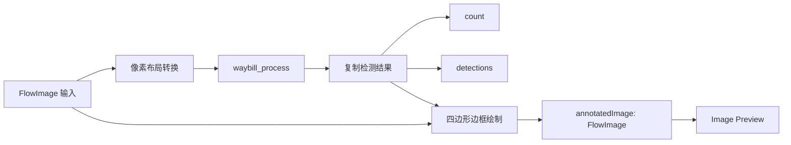

# Node.Algorithm 面单识别插件设计

## 1. 目标

在 NodeCraft 中新增 `Node.Algorithm` 插件，接入
`C:\Users\kevin\cs\waybill-recongize` 已有的 Windows x64 C++ 面单识别算法。
插件提供一个可在流程画布中使用的面单识别节点：输入 `FlowImage`，输出检测数量、检测详情和带四边形框选的 `FlowImage`。

插件不修改 `waybill-recongize` 的 C++ 源码或 C API；通过其稳定的 C ABI 调用现有 `waybill_infer.dll`。

## 2. 已确认的约束

- 宿主和插件使用 `.NET 8`、`net8.0-windows`、x64 进程。
- 图像类型只能使用 NodeCraft 现有的 `FlowImage`，显示使用现有 Image Preview 节点。
- 节点结果必须拆分为多个输出端口。
- C++ 句柄按 Session 复用；每次 iteration 只处理当前图像。
- C++ API 接收连续的 BGR、RGB 或灰度 HWC 像素缓冲；`FlowImage` 可能包含行 padding，需要在托管侧转换为连续缓冲。
- C++ 结果数组指向句柄内部内存，下一次处理后会失效；托管侧必须在每次调用后立即复制检测数据。
- 当前 `waybill-recongize` 构建使用 OpenCV 4.11.0、ONNX Runtime 1.20.1，并已有 `build-win` 构建目录。
- 不把由 CMake 生成的原生 DLL 或模型作为 NodeCraft 源码提交物；由显式 MSBuild staging target 从算法工程复制到插件包。

## 3. 方案选择

### 3.1 推荐方案：进程内 P/Invoke C API

插件通过 `[DllImport]` 调用 `waybill_infer.dll`，并在调用前用 Windows `AddDllDirectory` 将插件包的 `lib` 目录加入当前进程的 DLL 搜索目录。每个节点执行器拥有自己的 C++ 句柄，Session 启动时创建，Session 停止时释放。

优点是直接复用已经验证的 C ABI、无 IPC 延迟、无需复制 C++ 推理逻辑，并能在多个节点 Session 之间保持句柄隔离。缺点是原生库错误会使当前图执行失败，且插件包必须完整携带 OpenCV、ONNX Runtime 和 MSVC 运行库。

### 3.2 不采用：C++ 子进程或 CLI

子进程可以隔离原生崩溃，但需要增加进程管理、输入图像传输、结果协议和每帧 IPC；这与现有 C ABI 的句柄复用设计冲突，暂不采用。

### 3.3 不采用：C++/CLI 混合封装

C++/CLI 能提供更强的类型映射，但要求额外的 Windows 混合编译工具链，并会把插件与 C++/CLI ABI 绑定。现有纯 C ABI 已足够表达结构体和生命周期，因此不增加该层。

## 4. 插件与节点身份

插件项目和包布局：

```text
Node.Algorithm/
├── Node.Algorithm.csproj
├── plugin.json
├── Plugin/
│   └── AlgorithmPlugin.cs
├── Nodes/
│   ├── WaybillRecognizerNodeModel.cs
│   └── WaybillRecognizerExecutor.cs
├── Interop/
│   ├── WaybillNativeMethods.cs
│   ├── WaybillNativeSession.cs
│   └── WaybillRuntimeScope.cs
├── Imaging/
│   └── WaybillOverlayRenderer.cs
├── Models/
│   └── WaybillRecognitionResult.cs
└── Build/
    ├── AlgorithmPackaging.targets
    └── WaybillRuntimeFiles.txt
```

稳定身份：

- 插件 ID：`nodecraft.algorithm`
- 入口程序集：`Node.Algorithm.dll`
- 入口类型：`Node.Algorithm.Plugin.AlgorithmPlugin`
- 面单节点 TypeKey：`nodecraft.algorithm.waybill-recognizer`

`plugin.json` 使用当前宿主契约版本 `1.0` 和私有依赖目录 `lib`。插件程序集不复制 `NodeCraft.Flow.dll`、`CommonControls.WPF.dll` 或 WPF 框架程序集。

## 5. 节点数据契约

### 5.1 输入端口

| 端口 | Flow 类型 | 可用性 | 约束 |
| --- | --- | --- | --- |
| `image` | `FlowDataType.Image` | Iteration | 必需；支持 `Bgr24`、`Rgb24`、`Mono8` |

`Depth16` 不属于 C++ 算法支持的输入格式，节点在该格式进入执行器时抛出明确错误。

### 5.2 输出端口

| 端口 | Flow 类型 | 可用性 | 内容 |
| --- | --- | --- | --- |
| `count` | `FlowDataType.Number` | Iteration | 当前图像中的检测数量 |
| `detections` | `FlowDataType.Object` | Iteration | `IReadOnlyList<WaybillDetection>`，数据已从原生内存复制 |
| `annotatedImage` | `FlowDataType.Image` | Iteration | 根据检测四边形绘制边框后的新 `FlowImage` |

`WaybillDetection` 至少包含：`Score`、四个有序角点、`GeometryMethod` 和 `MaskIou`。角点顺序沿用 C++ API 的“从视觉左上角开始、顺时针”语义。

`WaybillRecognitionResult` 作为内部聚合结果保存原图宽高和检测列表；对外的 `detections` 端口输出检测列表，`count` 端口输出列表长度。

### 5.3 节点配置

`WaybillRecognizerNodeModel` 保存以下可序列化配置，并通过 `IWorkflowNodeValueProvider` 写入 `WorkflowNode.Inputs`：

- `ModelPath`：默认 `models/baseline-2-960.onnx`；相对路径相对于插件包根目录解析。
- `Confidence`：默认 `0.35`，范围 `[0, 1]`。
- `Iou`：默认 `0.50`，范围 `[0, 1]`。
- `MinMaskAreaRatio`：默认 `0.0001`，范围 `(0, 1)`。
- `MaxDetections`：默认 `100`，范围 `[1, 300]`。
- `NumThreads`：默认 `0`，表示由 ONNX Runtime 自动选择；必须大于等于 `0`。

输入格式不作为独立配置保存，而是每次根据 `FlowImage.PixelFormat` 自动映射为 C++ 的 BGR、RGB 或 GRAY 枚举，避免节点配置与实际像素布局不一致。

## 6. 运行时数据流



### 6.1 Session 生命周期

1. `StartSessionAsync` 校验节点配置，解析模型绝对路径。
2. 校验 Windows x64 进程和插件 `lib` 目录。
3. 获取进程内原生 DLL 搜索目录作用域。
4. 调用 `waybill_create` 创建句柄并加载模型。
5. 将节点配置映射为 `WaybillConfig` 并调用 `waybill_set_cfg`。
6. 每次 `ExecuteAsync` 将当前 `FlowImage` 转为连续像素，调用 `waybill_process`，复制结果并绘制叠加图。
7. `StopSessionAsync` 先释放 C++ 句柄，再释放 DLL 搜索目录作用域。

如果 Session 启动的任一步骤失败，已创建的资源按反向顺序清理，原生错误转换为带 API 名称和错误码的托管异常。

### 6.2 像素缓冲转换

- packed 图像且 `Stride == Width * bytesPerPixel` 时，直接 pin 原有数组段。
- 有行 padding、非零数组 offset 或非数组内存时，复制为连续行缓冲。
- `Bgr24` 映射到 `WAYBILL_FORMAT_BGR`，`Rgb24` 映射到 `WAYBILL_FORMAT_RGB`，`Mono8` 映射到 `WAYBILL_FORMAT_GRAY`。
- 所有原生调用都在当前图执行器的串行 iteration 中完成；不跨线程共享同一 C++ 句柄。

### 6.3 叠加图生成

`WaybillOverlayRenderer` 只操作 `FlowImage` 的原始像素，不依赖 WPF 控件或 `BitmapSource`：

- 复制输入图像的完整 `stride * height` 缓冲，保留 `FlowImage` 的元数据。
- 对每个检测连接四个点和首点，绘制闭合四边形。
- BGR/RGB 图使用红色边框；Mono8 图使用最大亮度边框。
- 点和线段坐标裁剪到图像边界，避免错误模型输出写越界。
- 没有检测时仍返回新的 `FlowImage`，内容与输入一致，保证输出端口在每次成功 iteration 都有值。

## 7. 原生互操作边界

托管结构体使用 `StructLayout(LayoutKind.Sequential, Pack = 0)`，字段顺序和 C 头文件完全一致：

- `WaybillConfig`：三个 `float`、三个 `int32`。
- `WaybillResult`：`width`、`height`、`count` 和检测数组指针。
- `WaybillDetection`：`float score`、8 个 `int32` 坐标值、`int32 geometry_method`、`float mask_iou`。

检测数组通过 `IntPtr` 按 `Marshal.SizeOf<NativeWaybillDetection>()` 步进读取；禁止让 CLR 直接拥有或释放 C++ 返回的指针。复制完成后可调用 `waybill_release_detections` 清空结果视图，但内存仍由句柄管理。

所有导入函数使用 `CallingConvention.Cdecl`、`ExactSpelling = true`，模型路径使用 UTF-8 字符串传入。

## 8. 原生运行时与打包

新增显式目标 `StageAlgorithmPlugin`，默认输出到：

```text
artifacts/Plugins/Node.Algorithm/
├── plugin.json
├── Node.Algorithm.dll
├── models/
│   └── baseline-2-960.onnx
└── lib/
    ├── waybill_infer.dll
    ├── onnxruntime.dll
    ├── opencv_world4110.dll
    ├── msvcp140.dll
    ├── msvcp140_1.dll
    ├── msvcp140_2.dll
    ├── msvcp140_atomic_wait.dll
    ├── msvcp140_codecvt_ids.dll
    ├── vcruntime140.dll
    └── vcruntime140_1.dll
```

目标属性：

- `AlgorithmPackageRoot`：插件包输出目录。
- `WaybillSourceRoot`：算法工程根目录，默认定位到 NodeCraft 同级的 `waybill-recongize`。
- `WaybillRuntimeRoot`：算法 CMake Windows 构建输出目录，默认 `$(WaybillSourceRoot)\build-win`。
- `WaybillOpenCvRuntimeRoot`：OpenCV x64 运行库目录，默认定位到当前同级 `opencv-extract` 构建目录。
- `WaybillModelPath`：ONNX 模型文件，默认 `$(WaybillSourceRoot)\artifacts\candidates\baseline-2-960.onnx`。

目标只在显式调用时执行，不绑定到普通 `Build`，并在复制前只删除精确的 `AlgorithmPackageRoot`。缺少任意原生依赖、模型、插件程序集或 manifest 时一次性报出完整缺失路径。打包检查禁止出现共享宿主程序集。

## 9. 错误处理

- 模型路径为空、文件不存在或配置越界：Session 启动失败。
- `waybill_create` 返回模型加载/模型形状错误：抛出包含 `WAYBILL_ERR_*` 名称的 `WaybillNativeException`。
- 输入为 null、尺寸非法或像素格式不支持：当前 iteration 失败，不产生部分输出。
- `waybill_process` 失败：不使用旧结果，不更新任何三个输出端口。
- 取消令牌在进入原生调用前检查；同步原生推理期间无法强制中断，但 Session 停止仍会在调用返回后释放句柄。
- 叠加绘制只接受经过托管边界检查的整数坐标，不允许异常索引写入图像缓冲。

## 10. 测试与验收

### 10.1 自动化测试

加入 NodeCraft 测试跑棒和解决方案项目引用，覆盖：

- 项目平台、manifest、插件 Metadata、入口类型和稳定 TypeKey。
- 节点输入/输出端口顺序、Flow 类型、默认配置和 XML 往返。
- C API 结构体布局、错误码映射和 native result 指针复制逻辑。
- BGR24、RGB24、Mono8 的 stride/非连续缓冲转换；Depth16 被拒绝。
- 四边形绘制、边界裁剪、无检测图像和带 padding 图像。
- Executor Session 启动/停止资源顺序、成功输出和 native 错误传播；使用 fake native session 隔离无 DLL 单元测试。
- `StageAlgorithmPlugin` 使用临时 fake runtime 目录时的缺失文件检查、完整包布局和共享程序集排除。

### 10.2 真实原生冒烟

使用当前机器上的：

- `waybill-recongize\build-win\waybill_infer.dll`
- `waybill-recongize\build-win\onnxruntime.dll`
- OpenCV x64 `opencv_world4110.dll`
- `waybill-recongize\artifacts\candidates\baseline-2-960.onnx`
- `waybill-recongize\tests\fixtures\images\waybill_small.jpg`

执行一次真实模型推理，验证插件能够创建句柄、返回合法宽高和检测列表，并生成可交给 Image Preview 的 `FlowImage`。原生冒烟依赖本机算法构建产物，不作为没有这些外部资产时的托管单元测试前置条件。

### 10.3 验收标准

1. `dotnet build NodeCraft.sln` 成功。
2. NodeCraft 测试跑棒输出 `ALL PASS`。
3. 显式 staging 后，NodeCraft 能从 `artifacts/Plugins/Node.Algorithm` 冷加载插件。
4. 节点面板显示面单识别节点，连接 `FlowImage` 后执行能得到 `count`、`detections` 和 `annotatedImage` 三个输出。
5. `annotatedImage` 可直接连接现有 Image Preview 并显示检测四边形。
6. 停止图执行后原生句柄和运行时作用域均释放，无需修改系统 PATH 或全局环境变量。

## 11. 不在本次范围内

- OCR、运单号、地址或字段级文本识别。
- GPU、动态 batch、Linux 原生包和非 x64 Windows。
- 在 C++ 算法工程内新增语言绑定或修改其模型/推理逻辑。
- 新建专用图片预览控件；显示继续使用现有 `FlowImage Preview`。
- 自动把算法工程编译纳入 NodeCraft 的普通解决方案构建。
